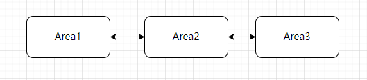
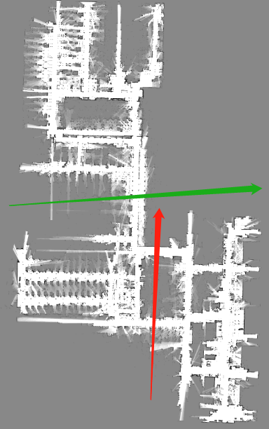
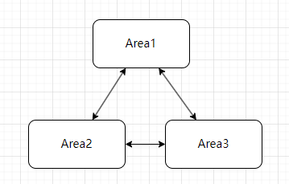
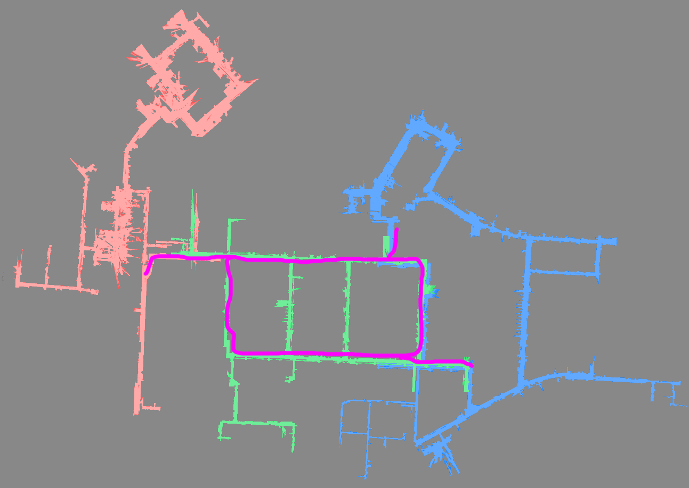

# Piece-by-Piece Mapping

When a map is too large for a single file, we can create several connected maps instead. When the robot is in the overlapping area between two maps, it can switch maps and continue its operation.

## Simple Method

### Steps for Simple Partitioned Mapping

1. First, create the map for Area 1.
2. Localize within Area 1 and move to the overlapping region between Area 1 and Area 2.
3. Start creating a new map, ensuring that `start_pose_type` is set to `"current_pose"`. This ensures the current coordinates are used as the starting point for the new map, maintaining continuity between the coordinate systems.
4. Once Area 2 is created, repeat the process.
5. Continue creating Area 3 and subsequent areas as needed.

You can increase the overlap between maps by moving back slightly into the previous area before starting the new map. A larger overlap provides a more robust area for map switching.

### Limitations of the Simple Method

This method only inherits the coordinates of the previous map at the starting point. Since there is no matching or loop closure between maps, alignment is only guaranteed near the starting point.

Maps with clear single-channel transition points are well-suited for this method.

If multiple channels connect the two parts, this simple method is not recommended.

As shown below, the green line indicates a suitable cut point, while the red line does not.

Furthermore, the partitioned areas should not form large loop structures, as illustrated below:

| Suitable            | Not Suitable            |
| ------------------- | ----------------------- |
|  |  |

## Backbone Method

The backbone method supports multi-channel scenarios and ensures proper alignment across all channels.

### Steps for Backbone Partitioned Mapping

1. First, analyze and plan the layout to identify the backbone and individual areas. The backbone should include major routes and large loops, connecting to all areas.
2. Create the backbone map by walking along the planned route and naming it "backbone". Once the backbone is established, the overall structure of the environment is defined.
3. Load the backbone map, navigate to the vicinity of Area 1, and begin incremental mapping.
4. When finishing the map, ensure that `new_map_only` is set to `true`. This ensures that only the new area is saved, excluding the backbone.
5. Repeat this process for each subsequent area.

Finally, the backbone map can be discarded; its purpose is solely to facilitate matching and loop closure between the individual parts.

In the figure below, the purple line represents the backbone. Create the backbone first, then separately map the green, red, and blue areas.

