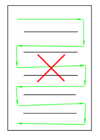
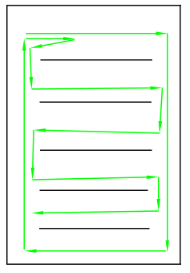
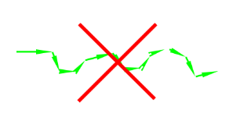
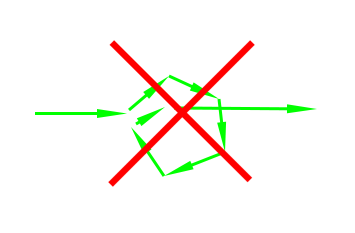
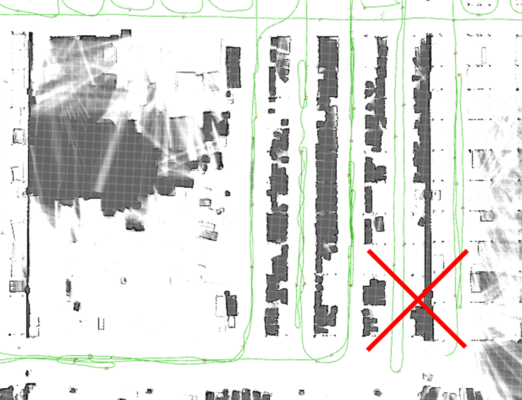

# Tips for Mapping Large Areas

## Abstract

The main purpose of this article is to guide users on how to successfully scan large scenes to complete mapping.

It also introduces the composition of map capacity. Understanding this knowledge can help you use good mapping habits to save CPU and memory, and create correct, complete, and large-scale maps.

<video width="100%" controls>
  <source src="./Mapping_Megastructures.mp4" type="video/mp4">
  Your browser does not support the video tag.
</video>

## Scene Analysis

Map data is not just a simple image. It contains point clouds, submaps, trajectories, etc. Therefore, a larger area does not necessarily mean a larger map file.

For example, the following maps all have large areas:

Map 1: Sparse (The perimeter of a factory. Many large areas inside the factory are inaccessible. Only the perimeter roads can be driven. In the final mapping result, although the area is large, it is sparse, with only 10%-20% scanned by the laser). The map data will not be very large.

Map 2: Moderate (Inside a factory, with an open field of view, about 70% of the area can be scanned by the laser). Although the area is large, the field of view is relatively open, and the number of roads is moderate. You can scan the entire map by walking around a bit. The map data will not be very large.

Map 3: Full of narrow paths (Inside a factory, rows of neatly arranged shelves. All are narrow paths. It takes a long time to go through all the narrow paths. The map built this way will be very large).

Therefore, the absolute area of the map mainly affects the performance of the display during mapping and does not cause the map data to be too large. Map data mainly consists of submaps and point clouds.

## Key Points for Mapping Large Sites

1. When mapping, build the overall skeleton first in one go, and then go through the details. This helps improve the correctness of the overall shape of the map and avoids deformation and loop closure errors.

The IMU drifts over time. If there is a particularly large loop of several hundred meters, complete one loop in the shortest time possible to achieve loop closure. Then, take enough time to complete the details. As shown in the figure below, there is a 500-meter large loop. It took an hour to walk back to the starting point during mapping, causing the overall shape to be distorted.

The correct mapping method for such a large loop is:

1. Recalibrate IMU bias and gyro scale.
2. First, run through the entire large loop in the shortest time to complete the loop closure.
3. Then, slowly build the small roads and details around the already formed backbone.

| Bad Case | Good Case |
|----------|-----------|
| Only walking in a serpentine pattern without loop closure will cause overall deformation | Walk one loop first to establish the skeleton, then walk the details |
|   |  |

2. Avoid S-shaped movements or spinning in place. These will increase the amount of data.

| Bad Case | Bad Case |
|----------|----------|
| Serpentine movement | Spinning in place |
|  |  |

3. Plan your route well. Use appropriate loop closures (just walk a bit of the repeated road), and try to avoid repeating large sections of the road. Sometimes repeated roads are unavoidable, but if more than 20-30% of the road is repeated, the route planning might not be appropriate.

| Bad Case |
|----------|
| Walking the same road too many times |
|  |

4. Do not exceed 1 hour for a single mapping session. If the area is truly very large, you can finish the skeleton in one go and then end the mapping. Use incremental mapping to complete the details in multiple sessions. If you need to leave temporarily during mapping (e.g., for a meal), end the mapping first and then use incremental mapping when you return.

