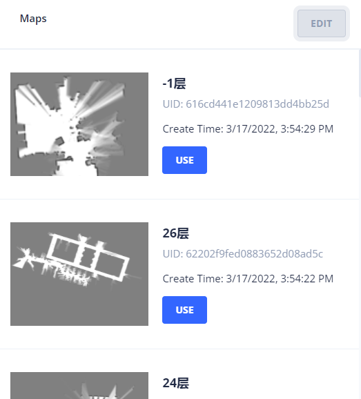
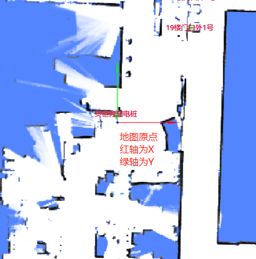
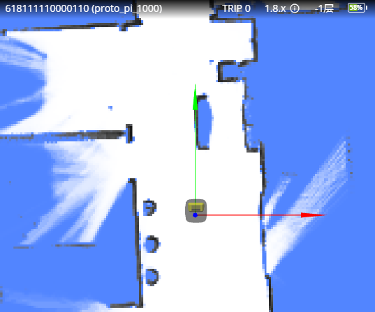

# Start Moving

To move the robot, two prerequisites must be met:

1. A map must be set.
2. An initial pose must be given.

## Setting a Map

You can use the [RobotAdmin](./robot_admin.md) website to set the map where the robot is located.



Alternatively, use the [Map List API](../reference/maps.md#map-list) to find a map ID.
Then, use `POST /chassis/current-map` to set it as the current map.

```bash
curl -X POST \
  -H "Content-Type: application/json" \
  -d '{"map_id": 286}' \
  http://192.168.25.25:8090/chassis/current-map
```

```json
{
  "id": 286,
  "uid": "616cd441e1209813dd4bb25d",
  "map_name": "-1层",
  "create_time": 1647503669,
  "map_version": 6,
  "overlays_version": 8
}
```

## Coordinates



In `RobotAdmin`, two arrows (red for the X-axis and blue for the Y-axis) intersect at the map's origin.
These two axes form an orthogonal rectangular coordinate system.

The coordinates of a point on the map are marked as $(x, y)$, representing the distances in meters from the origin.

A `pose` is typically expressed as:

```json
{
  "pos": [0.12, 0.85], // Position.
  "ori": 1.57 // Orientation in radians. The positive X-axis direction is 0, measured counter-clockwise.
}
```

## Setting Pose

To move the robot, an initial pose must be given.

As a common practice, mapping begins at the charger.
Consequently, the initial pose of the robot (on the charger) becomes the origin of the map.

```bash
curl -X POST \
  -H "Content-Type: application/json" \
  -d '{"position": [0, 0, 0], "ori": 1.57}' \
  http://192.168.25.25:8090/chassis/pose
```

- `position: [0, 0, 0]` means $x=0, y=0, z=0$.
- `ori: 1.57` ($\pi/2$) means the robot's heading is in the positive Y direction.

Once the map and initial pose are both set, the robot will be visible in `RobotAdmin` as follows:



## Start Moving

To move the robot, use `POST /chassis/moves` to create a move action.

```bash
curl -X POST \
  -H "Content-Type: application/json" \
  -d '{"type":"standard", "target_x":0.731, "target_y":-1.525, "target_z":0, "creator":"head-unit"}' \
  http://192.168.25.25:8090/chassis/moves
```

```json
{
  "id": 4409,
  "creator": "head-unit",
  "state": "moving",
  "type": "standard",
  "target_x": 0.731,
  "target_y": -1.525,
  "target_z": 0.0,
  "target_ori": null,
  "target_accuracy": null,
  "use_target_zone": null,
  "is_charging": null,
  "charge_retry_count": 0,
  "fail_reason": 0,
  "fail_reason_str": "None - None",
  "fail_message": "",
  "create_time": 1647509573,
  "last_modified_time": 1647509573
}
```

## Planning State

Use `GET /chassis/moves/:id` to check the state of a move action.

```bash
curl http://192.168.25.25:8090/chassis/moves/4409
```

```json
{
  "id": 4409,
  "creator": "head-unit",
  "state": "finished",
  "type": "standard",
  "target_x": 0.7310126134385344,
  "target_y": -1.5250144001960249,
  "target_z": 0.0,
  "target_ori": null,
  "target_accuracy": null,
  "use_target_zone": null,
  "is_charging": null,
  "charge_retry_count": 0,
  "fail_reason": 0,
  "fail_reason_str": "None - None",
  "fail_message": "",
  "create_time": 1647509573,
  "last_modified_time": 1647509573
}
```

The `state` field shows the current status of the action.

The state of the current action changes constantly. While it can be queried using the API above, doing so is highly inefficient.
Therefore, we provide a `WebSocket` API that allows the robot to continuously report its state. This is more efficient than the request-response model of the REST API.
