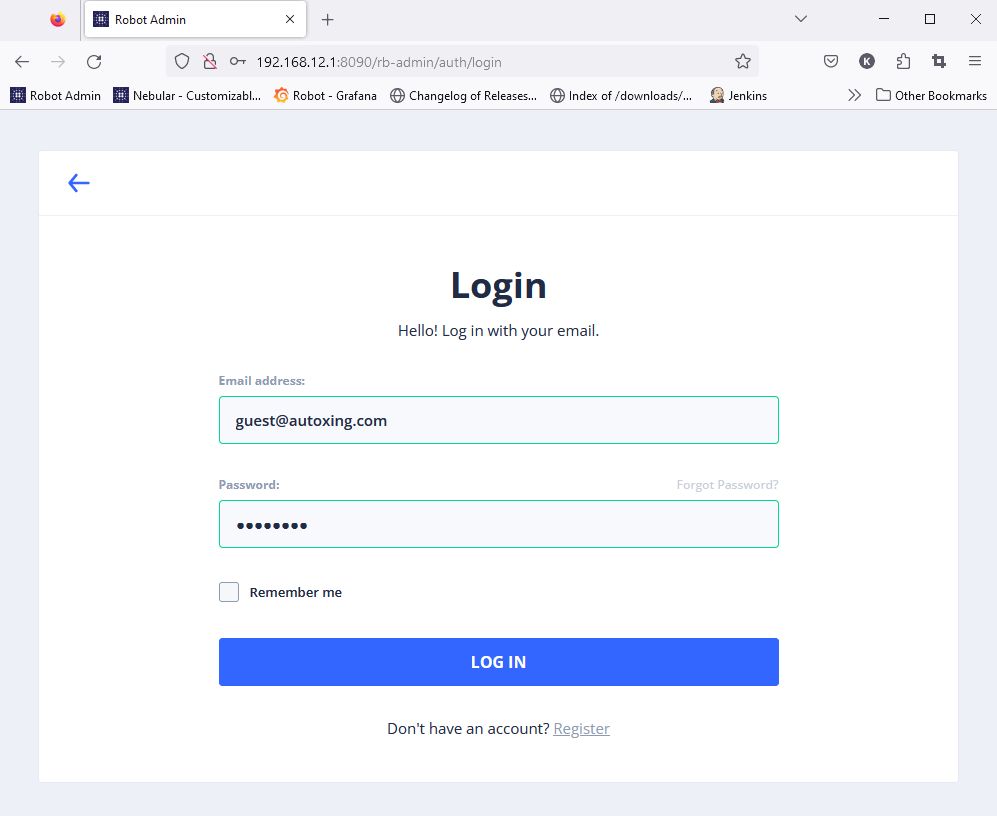
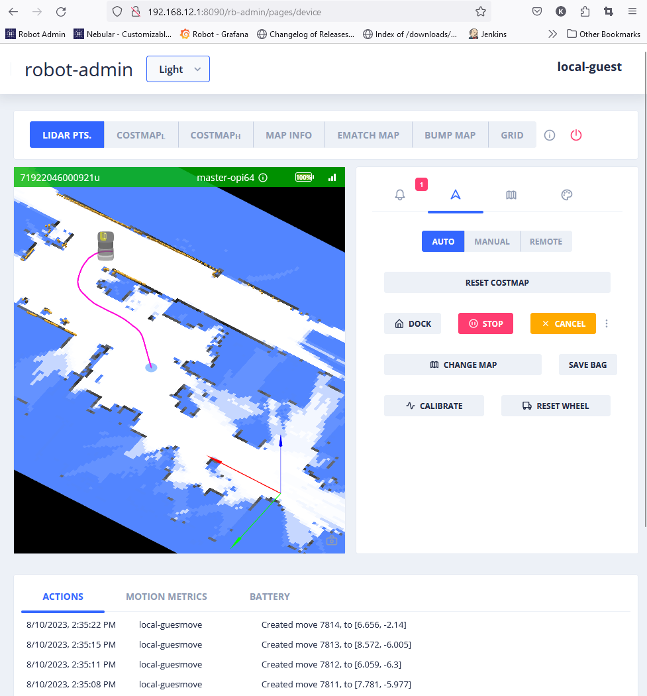
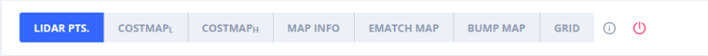
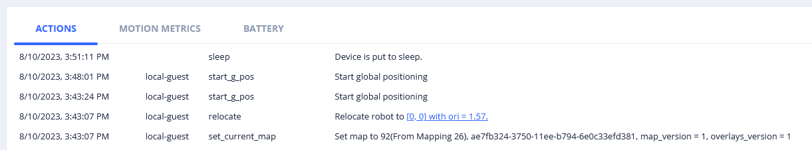
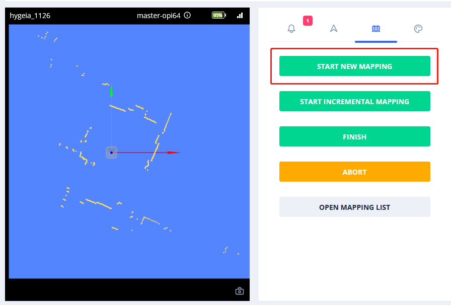
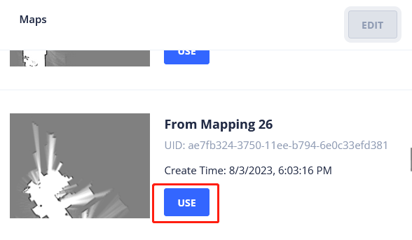
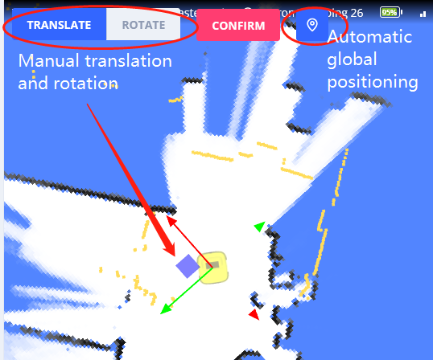

# Robot Admin (Standalone)

Robot admin (standalone version) is a pure frontend website(HTML+Javascript), served directly from the robot.

It calls the REST APIs of the robot.
By observing how it works, you can quickly learn how to use the APIs.

It's an optional package. When installed, you can access it from `http://ROBOT_IP:8090/rb-admin/`.

Login with username: `guest@autoxing.com`, password: `autoxing`.
Once login, you can do a lot of things like:

- Create new map
- Browse existing maps, and choose one as current map
- Set robot's current location
- Create move actions to move the robot
- Visualize sensor data(Lidar point clouds, depth camera point cloud, RGB camera, etc...)
- Calibrate sensors
- See alerts and action log
- Save bag file(for error reporting)

## Brief Introduction of UI

### Visualization Topic Bar

- LIDAR PTS - Lidar points
- COSTMAP(l) - Low resolution cost map
- COSTMAP(h) - High resolution cost map
- MAP INFO - Virtual Walls, Chargers, Elevator Areas, etc
- EMATCH MAP - Environment matching map, show the degree of map change since initial mapping
- BUMP MAP - See the bumpiness perceived by the robot when it moves
- GRID - 1m x 1m grids

### Control Tabs

From left to right:

- Alerts - Show alerts of the robot
- Control - When this tab is active, in "AUTO" mode, you can "double click" on map to move the robot
- Mapping - For creating new map
- More Visualization Options - To see more data from sensors

### Action Panel

## Common Tasks

### Create New Map Remotely

1. Enable `LIDAR PTs.`
2. Switch to the 3rd tab, click "START NEW MAPPING". The robot will be in **mapping mode**

3. Switch to the 2rd tab, choose "Auto" mode.
4. Double click on free space around the robot. (Must double click on free space, which is white.)
5. Continuously move the robot around, until the map is complete.
6. Switch to the 3rd tab:
   1. If you just want to use the map temporarily, click "ABORT".
   2. If you want to save the map permanently, click "FINISH". It will be save in "Mapping List"

After clicking either "ABORT" or "FINISH", the robot will switch to **positioning mode**, you can move the robot around the newly created map.

To use a newly created map again:

1. Select "OPEN MAPPING LIST", to view all mappings tasks.
2. Click "SAVE" on one of the mapping task(for example "mapping 26"). It will be saved to "Map List".
3. Switch to the 2rd tab, click "CHANGE MAP", then click "USE" on "Mapping 27"

### Set Robot Current Position

Click the robot, the "adjustment bar" will appear.

**Automatic Global Positioning**

You can use the "automatic global positioning" button to determine the robot's position.
On a large map, it may take a while.

- If you are lucky, the robot will be moved to new position automatically.
- If the system can't be sure, you must click "CONFIRM" to the result.(See if the Lidar points align with the map perfectly)
- If you are not lucky. It will fail.

** Manual Positioning**

Click "TRANSLATE" or "ROTATE", then drag the cursor to move or rotate the robot.
