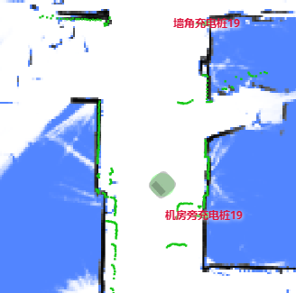

# Current Map and Pose API

## Set Current Map

There are several ways to set the current map:

- Using a `map_id` or `map_uid`.
- Providing the map data directly (available since version 2.7.0).
- Loading from a local file (available since version 2.11.0).

```bash
curl -X POST \
  -H "Content-Type: application/json" \
  -d '{"map_id": 286}' \
  http://192.168.25.25:8090/chassis/current-map
```

**Request Parameters**

```ts
class SetCurrentMapRequest {
  map_id?: number; // Either 'map_id' or 'map_uid' must be provided.

  // Available since version 2.5.2. The map can be identified by its "uid".
  // In earlier versions, only 'map_id' was supported.
  map_uid?: string;
}
```

### Set Current Map with Data

Starting from version 2.7.0, you can use the following `POST` request to set the current map directly.
**Note:** This method can be very slow for large maps.

```ts
class SetCurrentMapWithDataRequest {
  map_name: string;
  occupancy_grid: string; // Base64-encoded PNG image.
  carto_map: string; // Binary map data.
  grid_resolution: number; // e.g., 0.05
  grid_origin_x: number; // The X-coordinate of the lower-left corner of the PNG map.
  grid_origin_y: number; // The Y-coordinate of the lower-left corner of the PNG map.
  overlays: string; // Refer to the documentation on overlays.
}
```

### Set Current Map by Loading Local Files

Starting from version 2.11.0, the current map can be loaded directly from a local file on the robot.

```bash
curl -X POST http://localhost:8090/chassis/current-map \
  -H "Content-Type: application/json"
  --data '{"data_url":"file:///home/simba/tmp_map/map_73.pbstream", "map_name": "xxx"}'
```

Three files are required:

```
/home/simba/tmp_map/map_73.pbstream
/home/simba/tmp_map/map_73.png
/home/simba/tmp_map/map_73.yaml
```

The YAML file should contain the following structure:

```yaml
uid: 62202f9fed0883652d08ad5c
grid_origin_x: -5.900000095367432
grid_origin_y: -9.199999809265137
grid_resolution: 0.05
map_version: 3
overlays_version: 1
overlays: {
  "map_uid": "62202f9fed0883652d08ad5c",
  "features": []
}
```

## Get Current Map

```bash
curl http://192.168.25.25:8090/chassis/current-map
```

```json
{
  "id": 287,
  "uid": "62202f9fed0883652d08ad5c",
  "map_name": "26层",
  "create_time": 1647862075,
  "map_version": 15,
  "overlays_version": 25
}
```

The `id` corresponds to an entry in the [Map List](./maps.md#map-list).
If the current map was set directly with data, the `id` will be `-1`.

The latched WebSocket topic `/map/info` contains information about the currently active map.
A new message is broadcast on this topic whenever the current map changes.
```bash
$ wscat -c ws://192.168.25.25:8090/ws/v2/topics
> {"enable_topic": "/map/info"}
< {
  "topic": "/map/info",
  "name": "26层",
  "uid": "62202f9fed0883652d08ad5c",
  "map_version": 15,
  "overlays_version": 25,
  "overlays": {...}
}
```

## Set Pose

Sets the pose (position and orientation) of the robot on the current map.

```bash
curl -X POST \
  -H "Content-Type: application/json" \
  -d '{"position": [0, 0, 0], "ori": 1.57}' \
  http://192.168.25.25:8090/chassis/pose
```

**Request Parameters**

```ts
class SetPoseRequest {
  position: [number, number, number]; // Coordinates [x, y, z]. Note that `z` is always 0.
  ori: number; // The heading of the robot in radians, measured counter-clockwise. A value of 0 corresponds to the positive X-axis.

  // [Optional]
  // If true, the system will attempt to correct initial position errors within a small area.
  // If false, no correction will be attempted.
  // If not provided, the behavior is undefined and may vary depending on the software version,
  // environment, and global settings.
  adjust_position?: boolean;
}
```

When `adjust_position` is set to `true`, the system detects and corrects initial position errors based on Lidar observations.
For instance, if the robot's heading is incorrectly assigned, the system will make its best effort to correct it.

| Before Correction            | After Correction            |
| ---------------------------- | --------------------------- |
|  |  |

:::warning
The correction algorithm can occasionally be misguided by changes in the environment.
Therefore, if you are certain the initial pose is correct—especially in environments with potentially misleading patterns—ensure that `adjust_position` is set to `false`.
:::

## Pose Feedback

The latched WebSocket topic `/tracked_pose` provides the latest robot pose.

```bash
$ wscat -c ws://192.168.25.25:8090/ws/v2/topics
> {"enable_topic": "/tracked_pose"}
< {"topic": "/tracked_pose", "pos": [-3.553, -0.288], "ori": -1.28}
< {"topic": "/tracked_pose", "pos": [-3.55, -0.285], "ori": -1.28}
```
