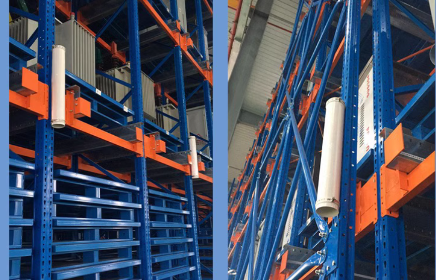

# Landmarks

Available since version 2.11.0.

In environments like warehouses where cargo is frequently moved, the legs of storage shelves often remain the only stable features. In such cases, Lidar landmarks can be used to enhance and stabilize positioning.

These landmarks are typically made of reflective material and are attached to stable structures like shelf legs. Pre-made reflective cylinders are also available from various suppliers.

The process for using landmarks is as follows:

## Deploying Landmarks

- Attach landmarks to permanent structures, such as wall corners or shelf legs.
- Adjacent landmarks should be spaced at least 1 meter apart, with a recommended density of one landmark every 10 to 50 meters. 

## Collecting Landmarks

There are two primary methods for collecting landmarks:

* **During a new mapping task:**
  1. Begin the mapping process as usual.
      - **Optional:** You can preview collected landmarks in real-time via the [`/landmarks`](../reference/websocket.md#landmarks) WebSocket channel.
  2. Complete the mapping task.
      - The final set of landmarks can be accessed via the `landmark_url` in the [mapping result details](../reference/mappings.md#mapping-detail).
* **For an existing map:**
   1. Use the [Collect Landmarks](./services.md#collect-landmarks) service.

Collected landmarks are not used directly; instead, they serve as raw data to be imported into the map's overlays. Save the landmarks into the overlays. For more information, see [landmarks in overlays](../reference/overlays.md#landmarks).

## Positioning with Landmarks

Once defined in the overlays, landmarks are automatically used to enhance the robot's positioning.

**Optional:** Active landmarks currently being used for positioning can be monitored via the `/constraint_list` WebSocket channel.