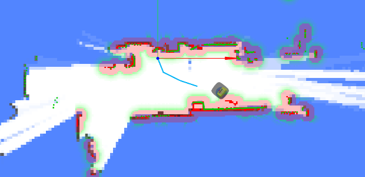

# Mapping API

With the Mapping API, you can:

1. Create, finish, cancel, or delete a mapping task.
2. View all mapping tasks.
3. Save the artifacts of a mapping task as a map.

A task has a state, which can be `running`, `finished`, `cancelled`, or `failed`.

When a task is successfully created, it enters the `running` state.
Once finished, it will contain a map and a bag file. The bag file contains the sensor data used during the creation of the map.

A mapping task (in `/mappings`) cannot be used for navigation. You must first save the artifacts of a mapping task into `/maps`.

## Start Mapping

```bash
curl -X POST \
  -H "Content-Type: application/json" \
  -d '{"continue_mapping": false}' \
  http://192.168.25.25:8090/mappings/
```

```
{
   "id":48,
   "thumbnail_url":null,
   "image_url":null,
   "grid_origin_x":0.0,
   "grid_origin_y":0.0,
   "grid_resolution":0.0,
   "url":"http://xxxx:10022/mappings/48",
   "start_time":1647520760,
   "end_time":null,
   "state":"running",
   "bag_id":null,
   "bag_url":null,
   "download_url":null
}
```

**Request Params**

```ts
interface MappingCreateRequest {
  // false (default) to create a new map.
  // true for incremental mapping.
  // If true, the current map (and its coordinates) will be inherited.
  continue_mapping: boolean;

  // (since 1.8.8)
  // zero (default): Use x=0, y=0, ori=0 as the starting point (starts a new coordinate frame).
  // current_pose: Use the current pose as the starting point (inherits the coordinate frame).
  start_pose_type: 'zero' | 'current_pose';
}
```

## Visualization of Mapping Process

During mapping, use WebSockets to receive real-time feedback:

- [Current Pose](./websocket.md#current-pose)
- [Map](./websocket.md#map): Updated at regular intervals.
- [Trajectory](./websocket.md#mapping-trajectory): A history of the trajectory that helps you identify which parts of the map have been visited.
- [Point Cloud](./websocket.md#lidar-point-cloud) and [Obstacle Map](./websocket.md#obstacle-map): These help avoid collisions during remote mapping.

They can be rendered like this:



## Finishing or Cancelling Mapping

```bash
curl -X PATCH \
  -H "Content-Type: application/json" \
  -d '{"state": "finished"}' \
  http://192.168.25.25:8090/mappings/current
```

**Request Params**

```ts
interface MappingFinishRequest {
  state: 'finished' | 'cancelled'; // Finish or cancel the mapping task

  // (since 1.8.8)
  // false (default): Save the entire map.
  // true: Save only the incremented part of the map (for incremental mapping only).
  new_map_only: boolean;
}
```

When a mapping task is finished, the artifacts are saved.
You can subsequently request them using `/mappings/:id`.

## Mapping List

```bash
curl http://192.168.25.25:8090/mappings/
```

```json
[
   {
      "id":48,
      "thumbnail_url":"http://192.168.25.25:8090/mappings/48/thumbnail",
      "image_url":"http://192.168.25.25:8090/mappings/48.png",
      "grid_origin_x":-8.050000190734863,
      "grid_origin_y":-5.650000095367432,
      "grid_resolution":0.05,
      "url":"http://192.168.25.25:8090/mappings/48",
      "start_time":1647520760,
      "end_time":1647520995,
      "state":"finished",
      "bag_id":27,
      "bag_url":"http://192.168.25.25:8090/bags/27.bag",
      "download_url":"http://192.168.25.25:8090/mappings/48/download",
      "trajectories_url": "http://192.168.25.25:8090/mappings/48/trajectories.json"
   },
   {
      "id":47,
      "thumbnail_url":null,
      "image_url":null,
      "grid_origin_x":0.0,
      "grid_origin_y":0.0,
      "grid_resolution":0.0,
      "url":"http://192.168.25.25:8090/mappings/47",
      "start_time":1647494329,
      "end_time":null,
      "state":"cancelled",
      "bag_id":null,
      "bag_url":null,
      "download_url":null
   },
```

## Mapping Detail

```bash
curl http://192.168.25.25:8090/mappings/48
```

```json
{
  "id": 48,
  "thumbnail_url": "http://192.168.25.25:8090/mappings/48/thumbnail",
  "image_url": "http://192.168.25.25:8090/mappings/48.png", // Base64-encoded map image (PNG, used for display)
  "grid_origin_x": -8.050000190734863,
  "grid_origin_y": -5.650000095367432,
  "grid_resolution": 0.05,
  "url": "http://192.168.25.25:8090/mappings/48",
  "start_time": 1647520760,
  "end_time": 1647520995,
  "state": "finished", // The current state: running, finished, cancelled, failed
  "bag_id": 27,
  "bag_url": "http://192.168.25.25:8090/bags/27.bag",
  "download_url": "http://192.168.25.25:8090/mappings/48/download", // Get Base64-encoded map data (binary, used for positioning)
  "trajectories_url": "http://192.168.25.25:8090/mappings/48/trajectories.json",
  "landmark_url": "http://192.168.25.25:8090/mappings/48/landmarks.json" // since 2.11.0
}
```

## Get Mapping Trajectory

```bash
curl http://192.168.25.25:8090/mappings/48/trajectories.json
```

```json
[
  {
    "id": 0,
    "coordinates": [
      [0, 0.01],
      [0.01, 0.11],
      [0, 0.01],
      [0.01, 0.11],
      [-0.12, 0.17]
    ]
  }
]
```

## Save Mapping Artifacts Directly as a Map

The robot can only load and use a map for navigation once it has been saved.
This method (using `mapping_id`) is more efficient than [POSTing the entire map](./maps.md#create-a-map) with all fields.


**Request**

```bash
curl -X POST http://192.168.25.25:8090/maps/
```

```json
{
  "map_name": "From Mapping 4", // Provide a name for the map
  "mapping_id": 4 // The ID of the mapping action
}
```

**Response**

```json
{
  "id": 119, // The ID of the newly created map. Use this ID to load it onto the robot.
  "uid": "9b94ac16-239b-11ed-9446-1e49da274768",
  "map_name": "From Mapping 4",
  "create_time": 1657015615,
  "map_version": 1,
  "overlays_version": 1,
  "thumbnail_url": "http://192.168.25.25:8090/maps/119/thumbnail",
  "image_url": "http://192.168.25.25:8090/maps/119.png",
  "url": "http://192.168.25.25:8090/maps/119"
}
```

## Delete a Mapping Task

```bash
curl -X DELETE http://192.168.25.25:8090/mappings/1
```

## Delete All Mapping Tasks

```bash
curl -X DELETE http://192.168.25.25:8090/mappings/
```

## Get Landmarks

Since 2.11.0

```bash
curl http://192.168.25.25:8090/mappings/48/landmarks.json
```

```json
[
  {
    "id": "landmark_1",
    "pos": [1.234, 2.345]
  },
  {
    "id": "landmark_2",
    "pos": [5.234, 8.345]
  }
]
```

