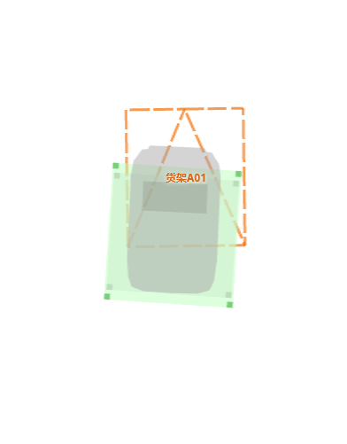
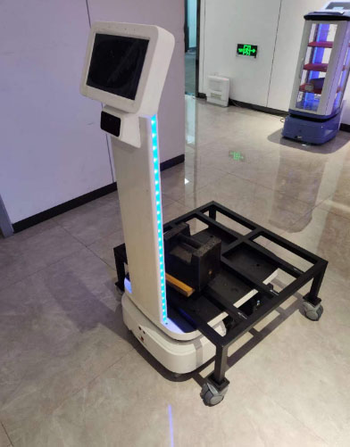
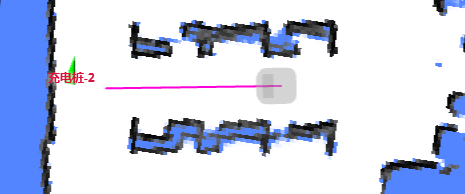

# Move API

## Create Move Action

```bash
curl -X POST \
  -H "Content-Type: application/json" \
  -d '{"creator": "xxx", "type": "standard" ...}' \
  http://192.168.25.25:8090/chassis/moves
```

**Returns**

```json
{
  "id": 5 // The ID of the newly created action.
}
```

**Request Parameters**

```ts
interface MoveActionCreate {
  creator: string; // The initiator of the action (for diagnostic purposes only).
  type:
    | 'standard'
    | 'charge' // Go to the charger and dock with it.
    | 'return_to_elevator_waiting_point'
    | 'enter_elevator'
    | 'leave_elevator' // Deprecated. Do not use.
    | 'along_given_route' // Follow a specified path.
    | 'align_with_rack' // Crawl under a rack (to jack it up later).
    | 'to_unload_point' // Move to a rack unload point (to jack it down later).
    | 'follow_target'; // Follow a moving target.
  target_x?: number;
  target_y?: number;
  target_z?: number;
  target_ori?: number;
  target_accuracy?: number; // In meters (optional).

  // A path to follow.
  //
  // Only valid when `type` is `along_given_route`.
  // A list of coordinates as a comma-separated string,
  // in the format "x1, y1, x2, y2".
  route_coordinates?: string;

  // The allowed detour distance when navigating around an obstacle
  // while following a specified path.
  //
  // Only valid when `type` is `along_given_route`.
  // When 0 is specified, the robot will always stop and wait before an obstacle
  // instead of attempting to go around it.
  detour_tolerance?: number;

  // If true, the action will succeed immediately
  // when within the radius of `target_accuracy`.
  use_target_zone?: boolean = false;

  charge_retry_count?: number; // Number of retries before the `charge` action fails.

  rack_area_id: string; // When executing point-to-area or area-to-area cargo move actions, provide the target rack area ID.

  properties?: { // Optional: since 2.11.0
    inplace_rotate?: boolean; // Optional. since 2.11.0: strictly rotate without any linear velocity.

    // Optional. An index into the layers of a rack stack. 
    // For type = "align_with_rack" and "to_unload_point".
    rack_layer?: number; 
  }
}
```

### Jack Device

Since 2.7.0, there is a new model (codename **Longjack**) that can crawl under a rack and jack it up.

In a typical point-to-point task, the robot should use the following sequence of commands to load cargo and unload it at another location:

1. **Crawl under the rack**: Create a move action with `type=align_with_rack` to crawl under the rack.
2. **Raise the jack device**: When the move succeeds, call `/services/jack_up`.
   1. The progress of the jack device is reported via the [Jack State Topic](../reference/websocket.md#jack-state).
   2. When the jack is fully up, the footprint of the robot will expand to accommodate that of the rack.
   The updated footprint can be received via the [Robot Model Topic](../reference/websocket.md#robot-model).
3. **Move to the unload point**: When the jack is fully up, create another move action with `type=to_unload_point` to move to the unload point.
4. **Lower the jack device**: Call `/services/jack_down` to unload.
5. Optionally, create the next move action. The robot will move away from the rack point before initiating the next action.

| Robot Admin Screenshot  | Photo                |
| ----------------------- | -------------------- |
|  |  |

:::warning
Certain parameters must be configured correctly for safe operation. See [rack.specs](./system_settings.md#rackspecs)
:::

### Point-to-Area Move

In addition to point-to-point moves, which transport a rack or pallet from one point to another, we also support:

* **Point-to-area move**: This is the most commonly used move when it is not known in advance which points in the target area are empty.
* **Area-to-area move**: Used when you want to move every rack or pallet from one area to another.

On the mapping platform, a rack area polygon should be added. All rack points within this area are considered part of a group.

Upon receiving a move action with `type=to_unload_point` and `rack_area_id={SOME_ID}`, the robot scans all rack points in that area and moves to the first empty point. If all points are occupied, the move fails with the error `NoFreeSpaceInRackArea`. 

Several new failure reasons have been introduced, such as:

* `InvalidRackAreaId`
* `InvalidRackArea`
* `UnknownRackSpaceState`
* `NoRackInRackArea`
* `AlignFailedInRackArea`
* `NoFreeSpaceInRackArea`
* `FailedToUnloadInRackArea`

### Area-to-Area Move

Create a move action with `type=align_with_rack` and `rack_area_id={SOME_ID}`; the robot patrols the source area, finds the first rack point containing a rack, and aligns with it.

### Follow Given Route Strictly

When `route_coordinates` is provided and `detour_tolerance=0`, the robot follows the route as closely as possible and does not attempt to evade obstacles (it will only stop in front of them).

This is frequently used for stock inspection.



### Follow Target

This action instructs the robot to follow a moving target.

```
curl -X POST
  -H "content-type: application/json" \
  --data '{"type":"follow_target"}' \
  http://192.168.25.25:8090/chassis/moves
```

Once this action is created, the user should send target poses via the WebSocket topic `/follow_target_state`: See [Follow Target](../reference/websocket.md#follow-target-state)


## Get Move Action Detail

```bash
curl http://192.168.25.25:8090/chassis/moves/4409
```

```json
{
  "id": 4409,
  "creator": "robot-admin-web",
  "state": "cancelled",
  "type": "standard",
  "target_x": 0.7310126134385344,
  "target_y": -1.5250144001960249,
  "target_z": 0.0,
  "target_ori": null,
  "target_accuracy": null,
  "use_target_zone": null,
  "is_charging": null,
  "charge_retry_count": 0,
  "fail_reason": 0, // See MoveFailReason
  "fail_reason_str": "None - None",
  "fail_message": "",
  "create_time": 1647509573,
  "last_modified_time": 1647509573
}
```

**Response Explained**

```ts
interface MoveAction extends MoveActionCreate {
  state: 'idle' | 'moving' | 'succeeded' | 'failed' | 'cancelled';
  create_time: number; // Unix timestamp (e.g., 1647509573).
  last_modified_time: number; // Unix timestamp (e.g., 1647509573).
  fail_reason: number; // Failure code. Only valid when state="failed".
  // Internal failure message for debugging. Only valid when state="failed".
  fail_reason_str: string;
  // Internal failure message in Chinese for debugging. Only valid when state="failed".
  fail_message: string;
}
```

## Move Action List

The history of all move actions.

```bash
curl http://192.168.25.25:8090/chassis/moves
```

```json
[
  {
    "id": 4409,
    "creator": "robot-admin-web",
    "state": "cancelled",
    "type": "standard",
    "fail_reason": 0, // See MoveFailReason
    "fail_reason_str": "None - None",
    "fail_message": "",
    "create_time": 1647509573,
    "last_modified_time": 1647509573
  },
  {
    "id": 4408,
    "creator": "control_unit",
    "state": "succeeded",
    "type": "none",
    "fail_reason": 0, // See MoveFailReason
    "fail_reason_str": "None - None",
    "fail_message": "",
    "create_time": 1647427995,
    "last_modified_time": 1647428509
  }
]
```

## Move State Feedback

Use the WebSocket topic `/planning_state` to receive updates on the move state.

```json
{
  "topic": "/planning_state",
  "move_state": "moving",
  "target_poses": [
    {
      "pos": [2.3, 20.82],
      "ori": 0
    }
  ],
  "charger_pose": {
    "pos": [0, 0],
    "ori": 0
  },
  "going_back_to_charger": false,
  "action_id": 4410, // The ID of the currently executing (or last) move action.
  "fail_reason": 0, // See MoveFailReason
  "fail_reason_str": "none",
  "remaining_distance": 3.546117067337036,
  "move_intent": "none",
  "intent_target_pose": {
    "pos": [0, 0],
    "ori": 0
  },
  "stuck_state": "none"
}
```

## Cancel Current Move Action

```bash
curl -X PATCH \
  -H "Content-Type: application/json" \
  -d '{state: "cancelled"}' \
  http://192.168.25.25:8090/chassis/moves/current
```

```json
{ "state": "cancelled" }
```

## Move Failure Reasons

The `fail_reason` field is a numeric code indicating why a move action failed. 

```ts
enum MoveFailReason
{
  none = 0, // None
  unknown = 1, // Unknown reason
  GetMapFailed = 2, // Failed to obtain map (WorldMap)
  StartingPointOutOfMap = 3,  // Starting point is outside the map
  EndingPointOutOfMap = 4, // Ending point is outside the map
  StartingPointNotInGround = 5, // Starting point is not in a passable area
  EndingPointNotInGround = 6, // Ending point is not in a passable area
  StartingEqualEnding = 7, // Starting point and ending point are the same
  CalculateGlobalPathExtendedDataError = 8, // Failed to calculate global path extended data
  CalculationFailed = 9, // Roads are not connected
  CalculationTimeout = 10, // Calculation timeout
  NoGlobalPath = 11, // No global path available
  NotGrabStartIndexOnGlobalPath = 12, // Failed to grab starting point on the global path
  NotGrabEndIndexOnGlobalPath = 13, // Failed to grab ending point on the global path
  PlanningTimeout = 14, // Path planning unsuccessful for a long time
  MoveTimeout = 15, // Path planning successful, move timeout
  ControlCostmapError = 16, // Local obstacle avoidance map data error, sensor data anomaly
  PowerCableConnected = 17, // Currently charging with cable
  RotateTimeout = 18, // Rotation timeout
  ChargeRetryCountExceeded = 100, // Charge retry count exceeded
  ChargeDockDetectionError = 101, // Charge dock detection error
  ChargeDockSignalError = 102, // Did not receive successful docking signal from charge dock
  InvalidChargeDock = 103, // Invalid charge dock position
  AlreadyInCharging = 104, // Currently already charging
  NoChargeCurrent = 105, // No charge current received for a long time after contact
  InvalidCabinetPos = 200, // Invalid cabinet position
  CabinetDetectionError = 201, // Cabinet detection error
  NoDockWithConveyer = 202, // No docking with conveyer at the moment
  NoApproachConveyer = 203, // No approaching conveyer at the moment
  ElevatorPointOccupied = 300, // Elevator point occupied
  ElevatorClosed = 301, // Elevator closed
  ElevatorPointObscuredTimeout = 302, // Elevator point obscured for a long time
  ElevatorPointOccupancyDetectionTimeout = 303, // Elevator point occupancy detection timeout
  ElevatorEnterProgressUpdateTimeout = 304, // Elevator entry progress update timeout
  InvalidTrackPoints = 400, // Invalid track points (number of input coordinates is not even or number of track points < 2)
  TooFarFromStartOfTrack = 401, // Too far from start of track
  InvalidRackDetectionPos = 500, // Invalid rack detection point
  RackDetectionError = 501, // Rack detection error
  RackRetryCountExceeded = 502, // Exceeded retry count for docking
  UnloadPointOccupied = 503, // Unload point occupied
  UnloadPointUnreachable = 504, // Unload point unreachable
  RackMoved = 505, // Rack moved significantly
  JackInUpState = 506, // Jack in raised state
  InvalidRackAreaId = 507, // Invalid rack area ID
  InvalidRackArea = 508, // Invalid rack area (no rack positions)
  UnknownRackSpaceState = 509, // Unknown rack space state
  NoRackInRackArea = 510, // No racks in rack area
  AlignFailedInRackArea = 511, // Docking failed in rack area with racks
  NoFreeSpaceInRackArea = 512, // No free space in rack area
  FailedToUnloadInRackArea = 513, // Failed to unload in rack area with free rack positions
  FollowFailed = 600, // Follow target lost
  PoiDetectionError = 700, // POI detection error
  PoiUnreachable = 701, // POI unreachable
  BarcodeDetectionError = 702, // Barcode detection error
  PlatformAlertError = 1000, // System exception
  ServiceCallError = 1001, // Service call error (restapi usage)
  InternalError = 1002, // Internal ASSERT error
  MapChanged = 1003, // Map changed or cleared during task execution
  MoveActionTypeDeprecated = 1004, // Interface deprecated
}
```

A more up-to-date version is available at [this URL](https://rb-admin.autoxing.com/api/v1/static/move_failed_reason.json).
