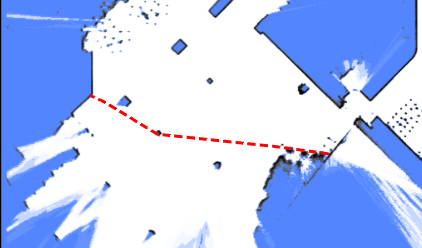
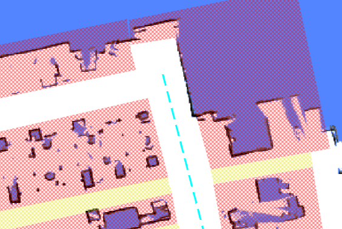
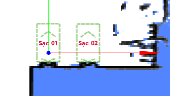
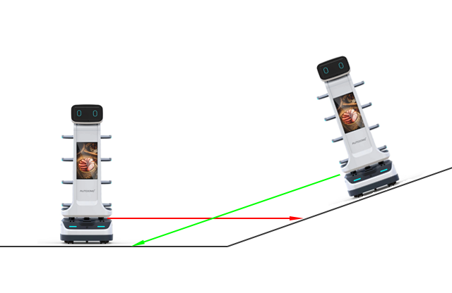

# Overlays

The `overlays` field of a map is in GeoJSON format. It contains virtual walls, virtual regions, automatic doors, dockers, cargo-load points, etc.

To update the overlays of a map, see [Modify Map](./maps.md#modify-map).

The top-level format is:

```json
{
    "type":"FeatureCollection",
    "features":[
        {}, // feature 1
        {}, // feature 2
        {}, // feature 3
    ]
}
```

Each feature can be a point, a polyline, or a polygon. For example, here is a polygon:

```json
{
    "type":"FeatureCollection",
    "features":[
        {
            "id":"SampleGate",
            "type":"Feature",
            "properties":{
                "regionType": 4,
                "mac":"30C6F72FAE1C"
            },
            "geometry":{
                "type":"Polygon",
                "coordinates":[
                    [
                        [
                        -2.702,
                        -5.784
                        ],
                        [
                        -1.007,
                        -5.827
                        ],
                        [
                        -1.053,
                        -6.348
                        ],
                        [
                        -2.546,
                        -6.385
                        ]
                    ]
                ]
            }
        }
    ]
}
```

## Virtual Walls and Regions

Virtual walls and regions are used to prevent the robot from entering specific areas.

**Virtual walls** are `LineString` features. They prevent the robot from crossing from one side to the other and are often used to guide global path calculations.



```json
{
    "id": "19f0684fdf2b1695054df052e002d8f6",
    "type": "Feature",
    "properties": {
        "lineType": "2",
        "mapOverlay": true
    },
    "geometry": {
        "type": "LineString",
        "coordinates": [
            [
                -35.0222214524365,
                -14.968376602837452
            ],
            [
                -35.094466030898275,
                -22.120589758429787
            ],
            [
                2.4727142286451453,
                -22.554057221952917
            ],
            [
                2.54495880739114,
                -15.329599487756695
            ],
            [
                -35.0222214524365,
                -15.112865751092386
            ]
        ]
    }
}
```

**Virtual regions** are more restrictive than virtual walls; if the robot accidentally enters a virtual region, it will be unable to move in any direction.



```json
{
   "id": "4d14040ea1ee7dd2e1d778f04a224d7a",
   "type": "Feature",
   "properties": {
      "blocked": false,
      "mapOverlay": true,
      "regionType": "1"
   },
   "geometry": {
      "type": "Polygon",
      "coordinates": [
         [
            [
               -87.30882859651956,
               -43.42832073191971
            ],
            [
               -86.96655334631487,
               -24.85988841115727
            ],
            [
               0.22327395043930665,
               -25.754819491083936
            ],
            [
               0.22327395043930665,
               -44.23768299574249
            ],
            [
               -87.30882859651956,
               -43.42832073191971
            ]
         ]
      ]
   }
}
```

## Free Space

Free spaces are used to clear an area on the map, allowing the robot to move into those regions.
They are used to remove redundant obstacles after the map has been created.

```json
{
   "id": "e4d544e92262c538dc31e116b630043b",
   "type": "Feature",
   "properties": {
      "blocked": false,
      "mapOverlay": true,
      "regionType": "12"
   },
   "geometry": {
      "type": "Polygon",
      "coordinates": [
         [
            [
               1.1439716297445557,
               -16.400667528273516
            ],
            [
               3.5214924133697423,
               -16.438682980748354
            ],
            [
               2.9970246447419413,
               -25.260207920183575
            ],
            [
               0.6399114661803651,
               -25.07582059422475
            ],
            [
               1.1439716297445557,
               -16.400667528273516
            ]
         ]
      ]
   }
}
```

## Charger

Chargers are used with the `charge` move action type.



```json
{
   "id": "642562bcf0e02ee8aff7dea7",
   "type": "Feature",
   "geometry": {
      "type": "Point",
      "coordinates": [
         0,
         0
      ]
   },
   "properties": {
      "deviceIds": [
         "6181307902152yI"
      ],
      "dockingPointId": "65655d96f0e02ee8afc9cc5e",
      "mapOverlay": true,
      "name": "sac_01",
      "type": "9",
      "yaw": 90
   }
}
```

## Automatic Door

When automatic doors are defined, the robot can open doors in its path.
A door is represented as a polygon and must include a `mac` property.

:::warning
The polygon must encompass the entire area through which the door moves.
If the area is too small, the door may collide with the waiting robot as it opens.
:::

```json
{
    "type":"Feature",
    "properties":{
        "regionType": 4,
        "mac":"30C6F72FAE1C"
    },
    "geometry":{
        "type":"Polygon",
        "coordinates":[
            [
                [
                -2.702,
                -5.784
                ],
                [
                -1.007,
                -5.827
                ],
                [
                -1.053,
                -6.348
                ],
                [
                -2.546,
                -6.385
                ]
            ]
        ]
    }
}
```

## Cargo Point

Similar to a charger, this point indicates where the robot can find racks for loading or unloading.
It should be used with the `align_with_rack` and `to_unload_point` move action types.


## Barcode

[Barcodes](./services.md#barcode) are used to uniquely determine the global pose of the robot.

```json
{
    "id": "d43d15cf4e4ad0bd2a24891badd74891",
    "type": "Feature",
    "properties": {
        "mapOverlay": true,
        "name": "Some user defined name",
        "barcodeId": "D2_29",
        "type": "37",
        "yaw": "177.8"
    }
    "geometry": {
        "coordinates": [
            -1.052,
            -5.485
        ],
        "type": "Point"
    }
}
```

## LiDAR Deceitful Area

In areas with uneven terrain, the 2D LiDAR may consistently hit the ground and mistake it for a wall.



Adding a "LiDAR deceitful area" can help resolve this issue. 
When moving through these areas, the robot will prioritize wheel odometry over LiDAR observations.

```json
{
    "type":"Feature",
    "properties":{
        "regionType": 8,
    },
    "geometry":{
        "type":"Polygon",
        "coordinates":[
            [
                [
                -2.702,
                -5.784
                ],
                [
                -1.007,
                -5.827
                ],
                [
                -1.053,
                -6.348
                ],
                [
                -2.546,
                -6.385
                ]
            ]
        ]
    }
}
```

## Landmarks

Since 2.11.0

[Landmarks](./landmarks.md) are collected during the mapping process. 
They can only be used for positioning once they are stored in the map overlays.

```json
{
    "type":"Feature",
    "properties":{
        "type": "39",
        "landmarkId": "landmark_1"
    },
    "geometry":{
        "type":"Point",
        "coordinates": [-2.702, -5.784]
    }
}
```
