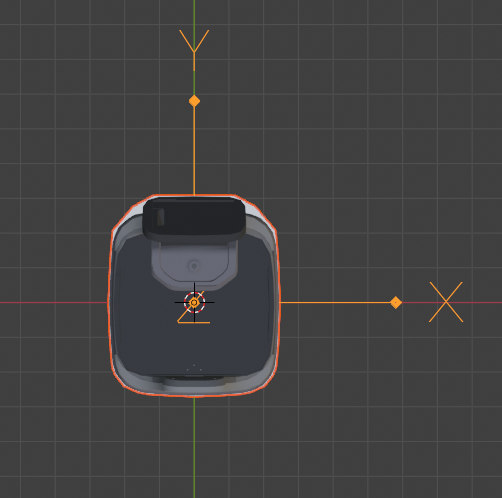

# Robot Parameters API

:::warning
DEPRECATED: Please use [System Settings](./system_settings.md) instead.
:::

## Get Parameters

```bash
curl http://192.168.25.25:8090/robot-params
```

```json
{
  "/wheel_control/max_forward_velocity": 0.8,
  "/wheel_control/max_backward_velocity": -0.2,
  "/wheel_control/max_forward_acc": 0.26,
  "/wheel_control/max_forward_decel": -2.0,
  "/wheel_control/max_angular_velocity": 0.78,
  "/wheel_control/acc_smoother/smooth_level": "normal", // Available since version 2.7.0. Options: "disabled", "lower", "normal", "higher".
  "/planning/auto_hold": true, // Available since version 2.3.0.
  "/control/bump_tolerance": 0.5, // Available since version 2.4.0.
  "/control/bump_based_speed_limit/enable": true, // Available since version 2.7.4.
  "/robot/footprint": [[0.248, 0.108], [0.24, 0.174], "..." , [0.248, -0.108]] // Available since version 2.5.0.
}
```

The `/planning/auto_hold` parameter determines whether the wheels are locked or free when the robot is idle.
When `auto_hold` is disabled and the robot is not performing a task, it can be freely pushed or dragged.
This is useful for manually adjusting the robot's heading or positioning it for loading goods.
However, if the robot is on a steep slope, the wheels will remain locked for safety, even if `auto_hold` is disabled.

The `/control/bump_based_speed_limit/enable` parameter determines whether the robot uses detected bumpiness to automatically decelerate.
The `/control/bump_tolerance` parameter sets the robot's sensitivity to bumpiness.
The value ranges from 0 to 1, with 0.5 as the neutral setting.
The robot will slow down when detected bumpiness exceeds the tolerance level.
The system also learns the locations of door sills and other bumpy areas on the map, allowing the robot to decelerate in advance.
A larger value makes the robot less sensitive to bumpiness.
A smaller value causes the robot to move more cautiously (slowing down more for door sills and uneven surfaces).

## Set Parameters

Multiple parameters can be updated in a single request.

```bash
curl -X POST \
  -H "Content-Type: application/json" \
  -d '{"/wheel_control/max_forward_velocity": 1.2, "/control/bump_tolerance": 0.5}' \
  http://192.168.25.25:8090/robot-params
```

## Get Default Parameters

```bash
curl http://192.168.25.25:8090/robot-params/default # Available since version 2.7.6.
```

## Robot Footprint

The `/robot/footprint` parameter should accurately represent the top-down profile of the robot. 
This footprint is used for collision detection and must be configured correctly to ensure safe operation.
The footprint data must adhere to the following rules:

1. The origin (0,0) must be the rotation center of the robot.
2. The X-axis points to the robot's right, and the Y-axis points to the robot's front.
3. The polygon **MUST BE CONVEX**.
4. The polygon should not be closed (i.e., the first point should not be repeated as the last point).



Starting from version 2.7.0, you can use the [Robot Model Topic](../reference/websocket.md#robot-model) to monitor real-time changes to the footprint. For example, when a rack is mounted, the footprint automatically updates to the combined convex hull of the robot and the rack.

