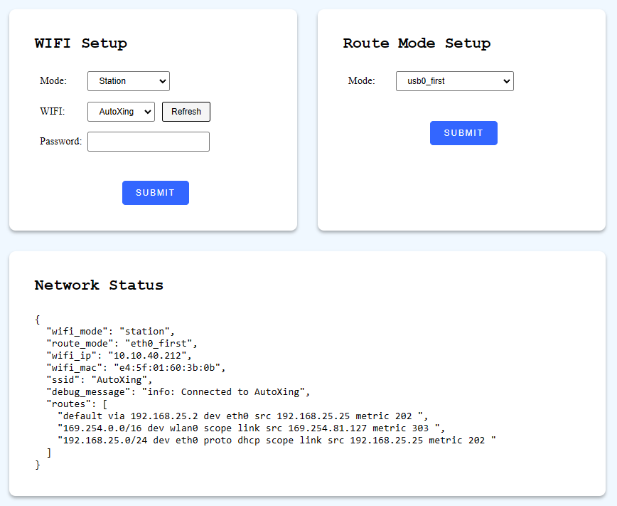
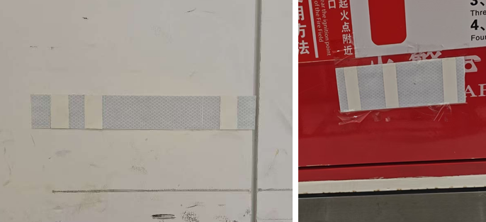
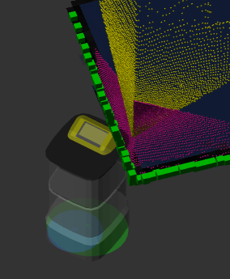
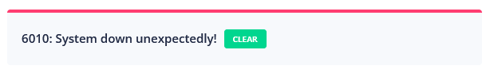
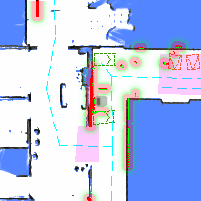
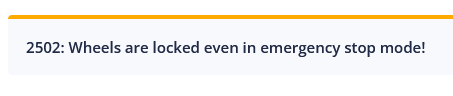

# Service API

## Recalibrate IMU

Calibrate IMU. The robot must be set still on hard and flat surface.

```bash
curl -X POST \
  -H "Content-Type: application/json" \
  http://192.168.25.25:8090/services/imu/recalibrate
```

This service call only initiates the calibration. The actual process usually takes 10-20 seconds.

When calibration finished. An action will be received in websocket:

Sample success output:

```json
{
  "topic": "/action",
  "timestamp": 1681733608.653,
  "email": "",
  "username": "",
  "deviceName": "718220110000909",
  "action": "recalibrate_imu",
  "message": "IMU calibration succeeded"
}
```

Sample failure output:

```json
{
  "topic": "/action",
  "timestamp": 1681733580.702,
  "email": "",
  "username": "",
  "deviceName": "718220110000909",
  "action": "recalibrate_imu",
  "message": "error: IMU calibration failed. Failed to rotate to right"
}
```

## Set Control Mode

```bash
curl -X POST \
  -H "Content-Type: application/json" \
  -d '{"control_mode": "auto"}' \
  http://192.168.25.25:8090/services/wheel_control/set_control_mode
```

**Parameters**

```ts
class SetControlModeRequest {
  control_mode: 'auto' | 'manual' | 'remote';
}
```

Use `/wheel_state` websocket topic，to monitor wheel state.

```bash
$ wscat -c ws://192.168.25.25:8090/ws/v2/topics
> {"enable_topic": "/wheel_state"}
< {"topic": "/wheel_state", "control_mode": "auto", "emergency_stop_pressed": true }
```

## Set/Clear Emergency Stop

```bash
curl -X POST \
  -H "Content-Type: application/json" \
  -d '{"enable": true}' \
  http://192.168.25.25:8090/services/wheel_control/set_emergency_stop
```

**Parameters**

```ts
class SetEmergencyStopRequest {
  enable: boolean;
}
```

Use `/wheel_state` topic, to monitor emergency stop state.

```bash
$ wscat -c ws://192.168.25.25:8090/ws/v2/topics
> {"enable_topic": "/wheel_state"}
< {"topic": "/wheel_state", "control_mode": "auto", "emergency_stop_pressed": true }
```

## Restart Service

Restart all services.

```bash
curl -X POST \
  -H "Content-Type: application/json" \
  http://192.168.25.25:8090/services/restart_service
```

## Shutdown/Reboot Device

```bash
curl -X POST \
  -H "Content-Type: application/json" \
  -d '{"target": "main_power_supply", reboot: false}' \
  http://192.168.25.25:8090/services/baseboard/shutdown
```

**Parameters**

```ts
class ShutdownRequest {
  target:
    | 'main_computing_unit' // only reboot/shutdown the main computing board
    | 'main_power_supply'; // reboot/shutdown the whole device
  reboot: boolean; // true = reboot， false = shutdown
}
```

## Clear Wheel Errors

```bash
curl -X POST http://192.168.25.25:8090/services/wheel_control/clear_errors
```

## Clear Flip Error

Error 8004(flip error) usually means serious trouble - the robot might have fallen over.
It requires human checking. If the problem is solved, use this service to clear the error to make the robot operational again.

```bash
curl -X POST http://192.168.25.25:8090/services/monitor/clear_flip_error
```

## Clear Slide Error

:::warning
Experimental Feature
:::

Error 2008(slide error) means the the robot may have serious impact with some invisible obstacle. It demands human checking before clearing the error.

```bash
curl -X POST http://192.168.25.25:8090/services/monitor/clear_slipping_error
```

## Power On/Off Lidar

```bash
curl -X POST \
  -H "Content-Type: application/json" \
  -d '{"action": "power_on"}' \
  http://192.168.25.25:8090/services/baseboard/power_on_lidar
```

**Parameters**

```ts
class PowerOnRequest {
  action: 'power_on' | 'power_off';
}
```

## Power On/Off Depth Camera

```bash
curl -X POST \
  -H "Content-Type: application/json" \
  -d '{"enable": true}' \
  http://192.168.25.25:8090/services/depth_camera/enable_cameras
```

**Parameters**

```ts
class EnableDepthCameraRequest {
  enable: boolean;
}
```

## Setup Wifi

Switch WIFI to Access-Point or Station mode.

```bash
curl -X POST \
  -H "Content-Type: application/json" \
  -d '{"mode": "station", "ssid":"xxxxxxxxx", "psk": "xxxxx"}' \
  http://192.168.25.25:8090/services/setup_wifi
```

**Parameters**

```ts
interface SetupWifiRequest {
  mode: 'ap' | 'station';
  ssid?: string; // SSID, required for station mode
  psk?: string; // Wi-Fi Protected Access Pre-Shared Key, required for station mode

  route_mode?:
    | 'eth0_first'
    | 'wlan0_first'
    | 'usb0_first'
    | 'wlan0_usb0_auto_first';
}
```

## Set Route Mode

Set the route table rules of the chassis.

```bash
curl -X POST \
  -H "Content-Type: application/json" \
  -d '{"mode": "xxx"}' \
  http://192.168.25.25:8090/services/set_route_mode
```

**Parameters**

```ts
interface RouteModeRequest {
  mode: 'eth0_first' | 'wlan0_first' | 'usb0_first' | 'wlan0_usb0_auto_first';
}
```

`route_mode`: Set the priority of the route table

- `eth0_first`: Put eth0 as the default route, if available
- `wlan0_first`: Put wlan0 as the default route, if available
- `usb0_first`: Put usb0 as the default route, if available.
  Based on `ping` result. If wlan0 connects to Internet,
  use it as the default route. Or else, use wlan0.

A static HTML page is also provided and can be accessed from local network. http://192.168.25.25:8090/wifi_setup



## Wake Up Device

Awake the robot from sleeping state. If robot is already in awake state, it does nothing.

```bash
curl -X POST http://192.168.25.25:8090/services/wake_up_device
```

Monitor websocket [Sensor Manager State](./websocket.md#sensor-manager-state) for sleep/awake/awakening state.

## Start Global Positioning

```bash
curl -X POST \
  -H "Content-Type: application/json"
  http://192.168.25.25:8090/services/start_global_positioning
```

**Parameters**

```ts
interface StartGlobalPositioningRequest {
  use_barcode?: boolean; // default to true.
  use_base_map_match?: boolean; // default to true.
}
```

The feedback can be received from [Global Positioning State](./websocket.md#global-positioning-state).

### Barcode



Barcode is a marker which is made of interleaved reflective surface and ordinary surface.
In a given site, each barcode contains a unique ID. So, when a barcode is found, the robot will know its whereabouts unambiguously.

When `use_barcode` is true, it has higher priority over point-cloud-based matching. And when a match is found, it will always be trusted.
To use it, barcodes and theirs poses should be [collected into `overlays` of the map](./websocket.md#collected-barcode).

## Auto-Mapping

:::warning
Experimental Feature
:::

When "auto-mapping" is enabled, the robot will explore the environment automatically.
It's only available in mapping mode.

```bash
curl -X POST \
  -H "Content-Type: application/json" \
  -d '{"enable": true}' \
  http://192.168.25.25:8090/services/enable_auto_mapping
```

**Parameters**

```ts
interface EnableAutoMappingRequest {
  enable: boolean;
}
```

## Recheck Error

```
POST /services/monitor_recheck_errors
```

## Calibrate Depth Cameras

This service aligns the point clouds of depth cameras with the point cloud of horizontal lidar.

Before calling this service, make sure:

- The robot is on flat ground.
- The robot is facing a corner of wall or big box.



```
POST /services/calibrate_depth_cameras
```

## Calibrate Gyroscope Scale

Calibrate IMU. The robot must be set still on hard and flat surface.

```bash
curl -X POST \
  -H "Content-Type: application/json" \
  http://192.168.25.25:8090/services/imu/calibrate_gyro_scale
```

This service call only initiates the calibration. The actual process usually takes 20 seconds.

When calibration finished. An action will be received in websocket:

Sample success output:

```json
{
  "topic": "/action",
  "timestamp": 1681733608.653,
  "email": "",
  "username": "",
  "deviceName": "718220110000909",
  "action": "calibrate_gyro_scale",
  "message": "Gyroscope scale calibration succeeded"
}
```

Sample failure output:

```json
{
  "topic": "/action",
  "timestamp": 1681733580.702,
  "email": "",
  "username": "",
  "deviceName": "718220110000909",
  "action": "calibrate_gyro_scale",
  "message": "error: Gyroscope scale calibration failed. Please remove nearby obstacles."
}
```

## Reset Usb Devices

Resetting USB hub may help recover malfunctioned hardwares.

"1/3" means the `bus_id/dev_id` in a device tree. See [List Usb Devices](./device.md#list-usb-devices)

```bash
curl -X POST \
  -H "Content-Type: application/json" \
  -d '{"devices_to_reset": ["1/3", "8/1"]}' \
  http://192.168.25.25:8090/services/reset_usb_devices
```

## Clear Alert System-Down-Unexpectedly



```bash
curl -X POST \
  -H "Content-Type: application/json" \
  http://192.168.25.25:8090/services/clear_system_down_unexpectedly
```

## Clear Range Data All Zero Error

When all Lidar points have 0 values, it indicates the Lidar device is already broken(or will broke).

This service temporarily clear this error message.

```bash
curl -X POST \
  -H "Content-Type: application/json" \
  http://192.168.25.25:8090/services/clear_range_data_all_zero_error
```

## Jack Device Up/Down

Raise up or lower down the jack device. The state of the jack device is in Websocket [Jack State](./websocket.md#jack-state).

```bash
curl -X POST \
  -H "Content-Type: application/json" \
  http://192.168.25.25:8090/services/jack_up
```

```bash
curl -X POST \
  -H "Content-Type: application/json" \
  http://192.168.25.25:8090/services/jack_down
```

## Step Time

When time is wrong, use this service to correct it.

::: warning
`GET` is used to detect time error. But don't call it frequently. Please use websocket `/alerts` instead to detect time error.
:::

```bash
curl http://192.168.25.25:8090/services/step_time
```

```json
{
  "should_step": false, // there is no need to correct time
  "message": "there is no need to make step: system time is 0.000253560 seconds fast of NTP time"
}
```

`POST` is used to correct time.

```bash
curl -X POST http://192.168.25.25:8090/services/step_time
```

```json
{
  "message": "Step time successfully"
}
```

## Get Nav. Thumbnail

Since 2.8.0, requires `caps.supportsGetNavThumbnail`

Get an image snapshot of the robot and its surroundings, including map, costmap, point cloud, virtual walls, etc.

The image is 200x200 pixels, can be used for error reporting.



```json
{
  "stamp": 1707211001,
  "map_name": "Ground Floor",
  "map_uid": "xxxxx",
  "map_version": 3,
  "overlays_version": 8,
  "map": {
    "resolution": 0.05,
    "size": [200, 200],
    "origin": [12.12345, -3.12345],
    "data": "iVBORw0KGgoAAAANS..." // base64 encoded PNG
  }
}
```

## Get RGB Image

Since 2.8.0, requires `caps.supportsGetRgbImage`

Get the latest image of a RGB camera. It's similar with [Websocket RGB Image Stream](./websocket.md#rgb-image-stream). For some use cases which only require the image on rare occasions, this service is more efficient.

```bash
curl -X POST \
  -H "Content-Type: application/json" \
  -d '{"topic": "/rgb_cameras/front/compressed"}' \
  http://192.168.25.25:8090/services/get_rgb_image
```

The response is the same as the websocket topic.

## Load/Unload Cargo with Roller

Since 2.9.0

The state of the roller is in Websocket [Roller State](./websocket.md#roller-state).

```bash
curl -X POST \
  -H "Content-Type: application/json" \
  http://192.168.25.25:8090/services/roller_load
```

```bash
curl -X POST \
  -H "Content-Type: application/json" \
  http://192.168.25.25:8090/services/roller_unload
```

## Start Rack Size Detection

```bash
curl -X POST \
  -H "Content-Type: application/json" \
  http://192.168.25.25:8090/services/start_rack_size_detection

curl -X POST \
  -H "Content-Type: application/json" \
  http://192.168.25.25:8090/services/stop_rack_size_detection
```

Detect the width/depth of a rack with laser of the robot.

:::warning
Rather than using this service, it is more accurate to refer to 
the production manual (specification) of the rack or to simply measure it with a ruler.

Only when you don't have either of them, use this service as a last resort.
:::

Steps to use:

1. Push the robot in front of the rack.
2. Call `/start_rack_size_detection`.
3. Subscribe to [/detected_rack websocket topic](./websocket.md#detected-rack).
4. Push the robot slowly, under the rack.
5. If successfully detected, stop pushing and record the size of the rack.
6. Set the width/depth into [system settings](./system_settings.md#rackspecs).

## Clear Jack Errors

Jack device will report an error when overloads.

When it happens, most jack models can still accept new commands.
But some rare models will require manual clearing of errors before accepting new commands.

```bash
curl -X POST http://192.168.25.25:8090/services/clear_jack_errors
```

## Confirm Emergency Stop

When on slope or in slope area (specified in overlays), even emergency stop is pressed, 
wheels will not be released. And there will be a warning message in `/alerts` websocket topic:



If you want to push the robots around, use the following command to confirm releasing the wheels.

```bash
curl -X POST http://192.168.25.25:8090/services/confirm_estop
```


## Calibrate Depth Camera Masks

Some depth cameras can see parts of the robot itself. This service is used to determine which pixels in the depth camera should be treated as the body of itself and not be mistaken as obstacles.

Before calibrating, the robot should be placed in an empty space. No obstacles should be in the view of all depth cameras.

```bash
curl -X POST http://192.168.25.25:8090/services/calibrate_depth_camera_masks
```

## Collect Landmarks

This service is used to collect landmarks for an existing map.

```bash
curl -X POST http://192.168.25.25:8090/services/start_collecting_landmarks
curl -X POST http://192.168.25.25:8090/services/stop_collecting_landmarks
```

The result is stored in:

```bash
curl http://192.168.25.25:8090/collected_data
```

The collected data serves as raw materials. The developer must insert landmarks into [overlays](./overlays.md#landmarks) for them to work.

## Clear Fall Risk Warning

```bash
curl -X POST http://192.168.25.25:8090/services/clear_fall_risk_warning
```

## Query Pose

This API helps collect the poses of various points of interest (POIs). 

For example, when the robot docks on a charger, it calculates the charger’s pose 
based on the robot’s position. 

```bash
curl http://192.168.25.25:8090/services/query_pose/charger_pose
```

```json
{
    "pose": {
        "pos": [4.179, -26.094],
        "ori": 3.18,
    }
}
```

Similarly, if a forklift is parked in a cargo location, the system infers that
cargo location’s pose from the forklift’s position. 

```bash
curl http://192.168.25.25:8090/services/query_pose/pallet_pose
```


```json
{
    "pose": {
        "pos": [4.179, -26.094],
        "ori": 3.18,
    }

    // since 2.13.0. If reference == 'center_of_front_edge' the returned pose is
    // the center of the pallet front edge(new logic).
    // If not, the pose is the center of the pallet(deprecated).
    "ref": "center_of_front_edge"
}
```


