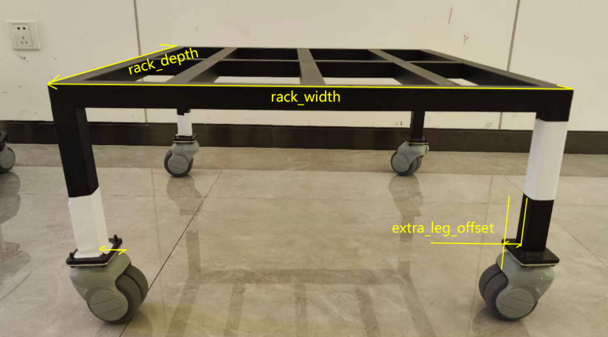
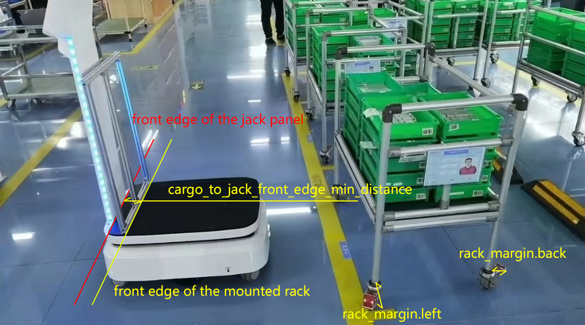

# System Settings

Supported since 2.9.0.

The system settings structure is as follows:

* **schema.json (read-only)** - Contains metadata for all settings, including names, types, ranges, and descriptions.
* **default.json (read-only)** - Contains the default values for all settings.
* **user.json** - Stores values modified by the user.
* **effective.json (read-only)** - Contains the final values, generated by overlaying `user.json` on top of `default.json`.

Only `user.json` is modifiable. Whenever it is updated, `effective.json` is automatically recalculated.

`schema.json` and `default.json` are read-only constants specific to the robot model.

## Schema

```bash
curl http://192.168.25.25:8090/system/settings/schema
```

```json
{
   "ax":[
      {
         "name":"robot.footprint",
         "title":"Robot: Footprint",
         "type":"Polygon",
         "default":[
            [
               0.248,
               0.108
            ],
            ["..."],
            [
               0.248,
               -0.108
            ]
         ]
      },
      {
         "name":"control.auto_hold",
         "title":"Control: Auto Hold",
         "type":"bool",
         "default":true,
         "description":"When idle, the robot shall hold still"
      },
      {
         "name":"control.max_forward_velocity",
         "title":"Control: Max Forward Velocity",
         "type":"float",
         "default":1.2,
         "range":"[0, 2.0]"
      },
      {
         "name":"control.max_backward_velocity",
         "title":"Control: Max Backward Velocity",
         "type":"float",
         "default":-0.2,
         "range":"[-0.3, 0]"
      },
      {
         "name":"control.max_forward_acc",
         "title":"Control: Max Forward Acc",
         "type":"float",
         "default":0.5,
         "range":"[0, 0.8]"
      },
      {
         "name":"control.max_forward_decel",
         "title":"Control: Max Forward Decel",
         "type":"float",
         "default":-2.0,
         "range":"[-2.0, 0]"
      },
      {
         "name":"control.max_angular_velocity",
         "title":"Control: Max Angular Velocity",
         "type":"float",
         "default":1.2,
         "range":"[0, 1.2]"
      },
      {
         "name":"control.acc_smoother.smooth_level",
         "title":"Control: Acc Smoother: Smooth Level",
         "type":"Enum",
         "default":"normal",
         "options":[
            "disabled",
            "lower",
            "normal",
            "higher"
         ]
      },
      {
         "name":"bump_based_speed_limit.enable",
         "title":"enable bump-based speed limit",
         "type":"bool",
         "default":true
      },
      {
         "name":"bump_based_speed_limit.bump_tolerance",
         "title":"Bump Based Speed Limit: Bump Tolerance",
         "type":"float",
         "default":0.5,
         "range":"[0, 1.0]"
      }
   ]
}
```


## Default Settings

```bash
curl http://192.168.25.25:8090/system/settings/default
```

## User Settings

Retrieve user settings:

```bash
curl http://192.168.25.25:8090/system/settings/user
```

Save user settings:

```bash
curl -X POST \
    -H "Content-Type: application/json" \
    -d '...' \
    http://192.168.25.25:8090/system/settings/user
```

Partial update of user settings:

```bash
curl -X PATCH \
    -H "Content-Type: application/json" \
    -d '...' \
    http://192.168.25.25:8090/system/settings/user
```

## Effective Settings

```bash
curl http://192.168.25.25:8090/system/settings/effective
```

## Setting Options

This section documents available configuration options.

### rack.specs

Defines the physical dimensions of a rack and how the robot should interact with it.

```json
{
   "rack.specs": [
      {
         "width": 0.66,
         "depth": 0.7,

         // Some racks have protruding parts (e.g., handles) that 
         // extend beyond the wheel base.
         "margin": [0, 0, 0, 0], 

         "alignment": "center",  // center/back. 
         "alignment_margin_back": 0.02,

         // Some rack legs have base plates that are invisible to the laser scanner.
         // The robot will avoid this extra area when moving underneath the rack.
         "extra_leg_offset": 0.02, 

         // Since 2.10: square/round/other
         "leg_shape": "square", 

         // Since 2.10: The side length of a square leg, or the diameter of a round leg.
         "leg_size": 0.03, 

         // Since 2.10. Some racks have caster wheels that are invisible to 
         // the robot's lasers. Use this parameter to expand the robot's 
         // footprint and prevent collisions.
         "foot_radius": 0.05 
      }
   ]
}
```

- `width`, `depth`: The dimensions of the rack.
- `margin`: Accounts for protruding parts outside the rectangle formed by the legs.
- `extra_leg_offset`: Accounts for inward-protruding legs that are not visible to the LiDAR.
- `cargo_to_jack_front_edge_min_distance`: The distance between the front edge of the rack and the front edge of the jack panel when the rack is mounted.





