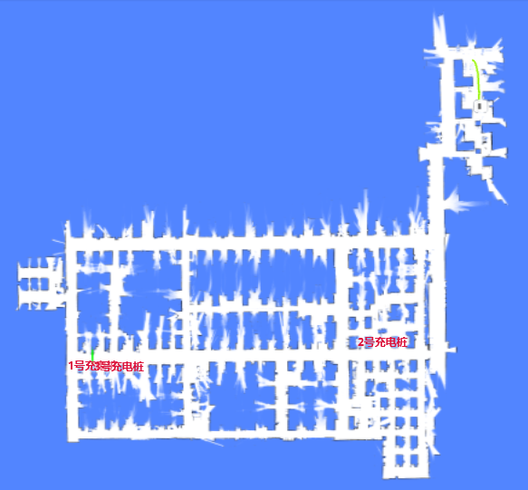
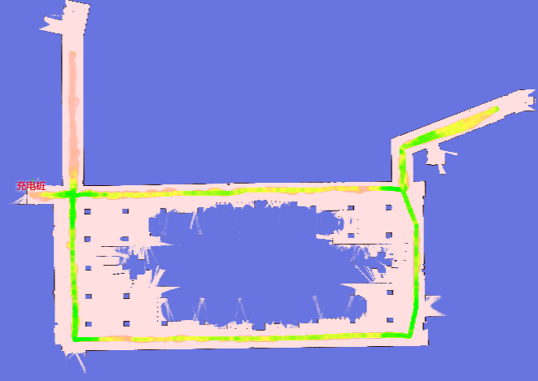

# WebSocket Reference

Topics are used to receive real-time information from the robot.
Use the following commands to start or stop listening to specific topics.

```
{"enable_topic": "TOPIC_NAME"}
{"disable_topic": "TOPIC_NAME"}
```

Since version 2.7.0, multiple topic names are supported. This requires the `supportsEnableTopicList` capability flag.

```
{"enable_topic": ["/actions", "/alerts", "/tracked_pose"]} // since 2.7.0
{"disable_topic": ["/actions", "/alerts", "/tracked_pose"]} // since 2.7.0
```

## Map

In pure-localization mode, the `/map` topic contains the currently used map and is updated only once.

In mapping mode, the map is updated at regular, short intervals.



```json
{
  "topic": "/map",
  "resolution": 0.1, // The width/height of a single pixel, in meters.
  "size": [182, 59], // The size of the image, in pixels.
  "origin": [-8.1, -4.8], // The world coordinates of the lower-left pixel.
  "data": "iVBORw0KGgoAAAANSUhEUgAAALYAAAA7BAAAAA..." // Base64-encoded PNG file.
}
```

## Obstacle Map

This shows the obstacles detected around the robot, including data from all sensors and virtual walls.

This is intended for debugging purposes, providing a view through the robot's sensors.

Dark-red pixels represent the actual obstacles, while light-red pixels are extruded based on the robot's inscribed radius. The center of the robot should never enter the red area; doing so indicates a collision.

| Low Res. Costmap           | High Res. Costmap            |
| -------------------------- | ---------------------------- |
| /maps/5cm/1hz              | /maps/1cm/1hz                |
| Used for path planning.    | Used for collision detection. |
|  |   |

```
{
  "topic": "/maps/5cm/1hz", // or '/maps/1cm/1hz'
  "resolution": 0.05,
  "size": [
    200,
    200
  ],
  "origin": [
    -2.8,
    -6.2
  ],
  "data": "iVBORw0KGgoAAAANSUhEUgAAAMgAAADICA..." // Base64-encoded PNG file.
}
```

## Wheel State

```json
{
  "topic": "/wheel_state",
  "control_mode": "auto", // auto/remote/manual
  "emergency_stop_pressed": true, // Whether in emergency stop mode.

  // Optional. Only supported by specific robot models. 
  // Some wheels have a release-wheels wire.
  // This flag reflects whether the wire is active.
  "wheels_released": true
}
```

## Positioning State

```json
{
  "topic": "/slam/state",
  
  // inactive: Idle. Not creating a map, and no map is set.
  // slam: Creating a map.
  // positioning: A map is set, and the robot is in the localization state.
  "state": "positioning",

  "reliable": true,       // false means the position is lost.

  // "lidar_reliable = False" means that no constraint exists between newly created 
  // observations (submaps) and the current static map.
  // 
  // The position loss steps are as follows:
  // 1. No constraints (between new observations and the static map) exist; "lidar_reliable" becomes false.
  // 2. The robot enters pure dead-reckoning mode, and "position_loss_progress" starts to increase.
  // 3. After some movement, if new constraints are created, "lidar_reliable" becomes true.
  //    However, if "position_loss_progress" reaches 1.0, "reliable" also becomes false.
  "lidar_reliable": false, // since 2.11.0-rc18
  "position_loss_progress": 0.35,  // since 2.11.0-rc18. Only exists when lidar_reliable = false.

  // The quality of positioning (Experimental).
  //
  // Only valid in the positioning state.
  // since 2.3.0.
  //  0 - unknown
  //  1 - lost
  //  3 - poor
  //  8 - good
  // 10 - excellent
  "position_quality": 10,
  
  // How much the current LiDAR points match the static map.
  "lidar_matching_score": 0.545, 

  // Other debugging flags.
  "lidar_matched": true,
  "wheel_slipping": false,
  "inter_constraint_count": 27,
  "good_constraint_count": 27
}
```

## Vision Detected Objects

::: warning
Experimental Feature
:::

```ts
enum VisualObjectLabel {
  none = 0,
  person = 1, // Person
  platformHandTruck = 2, // Platform hand truck
  scaffold = 3, // Scaffold
  queueStand = 4, // Queue stand
  portableGrandstand = 5, // Portable grandstand
}
```

```json
{
  "topic": "/vision_detected_objects",
  "boxes": [
    {
      "pose": { "pos": [0.32, 0.97], "ori": 0.0 }, // Object position and orientation.
      "dimensions": [0.0, 0.0, 0.0], // Object width, length, and height.
      "value": 0.8005573153495789,
      "label": 1 // VisualObjectLabel
    },
    {
      "pose": { "pos": [0.63, 1.08], "ori": 0.0 },
      "dimensions": [0.0, 0.0, 0.0],
      "value": 0.5348057150840759,
      "label": 1
    },
    {
      "pose": { "pos": [0.51, 0.74], "ori": 0.0 },
      "dimensions": [0.0, 0.0, 0.0],
      "value": 0.41888049244880676,
      "label": 1
    }
  ]
}
```

## Battery State


```json
{
  "topic": "/battery_state",
  "secs": 1653299708, // Timestamp.
  "voltage": 26.3, // Battery voltage.
  "current": 3.6, // Battery current. Generally negative when charging and positive when running.
  "percentage": 0.64, // Battery percentage.
  "power_supply_status": "discharging" // charging/discharging/full.
}
```

## Detailed Battery State

Since 2.11.0


```json
{
  "topic": "/detailed_battery_state",
  "secs": 1653299708, // Timestamp.
  "voltage": 26.3, // Battery voltage.
  "current": 3.6, // Battery current. Generally negative when charging and positive when running.
  "percentage": 0.64, // Battery percentage.
  "power_supply_status": "discharging", // charging/discharging/full.
  "cell_voltages": [4.141, 4.138, 4.139, 4.133, 4.136, 4.138, 4.138],
  "capacity": 14.0, // Ah
  "design_capacity": 15.0, // Ah
  "state_of_health": 0.93, // Percentage.
  "cycle_count": 80,
}
```

## Current Pose

The current pose in the world frame.

```json
{
  "topic": "/tracked_pose",
  "pos": [3.7325, -10.8525],
  "ori": -1.56 // Orientation. The positive X-axis is 0, and the positive Y-axis is pi/2.
}
```

## Planning State

Returns the execution state of the most recent move action.

```ts
enum ActionType {
  none,
  standard,
  charge,
  along_given_route, // Move along a specified track.
  return_to_elevator_waiting_point, // Used when failing to enter an elevator.
  enter_elevator,
  leave_elevator,
  pull_over, // (DO NOT USE) Pull over to make space for other robots.
  align_with_rack, // (DO NOT USE)
}

enum MoveState {
  none,
  idle,
  moving,
  succeeded,
  failed,
  cancelled,
}

enum StuckState {
  move_stucked,
  target_spin_stucked,
}
```

```json
{
  "topic": "/planning_state",

  "map_uid": "xxxxxx", // The UID of the current map.

  // action
  "action_id": 3354,
  "action_type": "enter_elevator", // See ActionType (since 2.5.2).
  "move_state": "moving", // See MoveState.
  "fail_reason": 0, // Valid when move_state == failed.
  "fail_reason_str": "none", // Valid when move_state == failed.
  "remaining_distance": 2.8750057220458984, // In meters.

  // target related
  "target_poses": [
    {
      "pos": [4.08, 2.99],
      "ori": 0
    }
  ],

  // intent related
  "move_intent": "", // Deprecated by `action_type`.
  "intent_target_pose": {
    // The pose of the current target.
    "pos": [0, 0],
    "ori": 0
  },

  // stuck state
  "stuck_state": "move_stucked", // See StuckState (since 2.5.2).
  "in_elevator": true, // Optional (since 2.5.2).
  "viewport_blocked": true, // Optional (since 2.5.2).

  // Optional (since 2.9.0). 
  // Destination is occupied by another robot, so it is waiting at the roadside.
  "is_waiting_for_dest": true,

  "docking_with_conveyer": true, // Optional (since 2.9.0).

  // Optional (since 2.11.0). Defaults to 0. 
  // Only valid when moving along a specified route.
  // Indicates the number of points already passed.
  "given_route_passed_point_count": 3 
}
```

## LiDAR Point Cloud


### Point Cloud Used for SLAM

The combined point cloud from one or more LiDAR devices (if any) used for SLAM.
The coordinates are in the world frame.

```json
{
  "topic": "/scan_matched_points2",
  "stamp": 1653302201889,
  "points": [
    [7.83, 3.84, 0.04],
    [7.8, 3.88, 0.04],
    [7.79, 4.14, 0.04]
    ...
  ]
}
```

### Point Cloud for Individual LiDAR Devices

Since 2.12.0

This topic is used to debug individual LiDAR devices.
The coordinates are in the world frame.

Commonly used topic names include:

```
/horizontal_laser_2d/matched
/left_laser_2d/matched
/right_laser_2d/matched
/lt_laser_2d/matched (left top)
/rb_laser_2d/matched (right back)
```

```json
{
    "topic": "/horizontal_laser_2d/matched",
    "stamp": 1741764468.939,
    "fields": [
        {
            "name": "x",
            "data_type": "f32"
        },
        {
            "name": "y",
            "data_type": "f32"
        },
        {
            "name": "z",
            "data_type": "f32"
        },
        {
            "name": "intensity",
            "data_type": "f32"
        }
    ],
    "data": "QphAQHPLmkHDpvk/xcTEPk+RQED22ppBp6..." // Base64-encoded binary data.
}
```

## Global Path

The current global path.


```json
{
  "topic": "/path",
  "stamp": 1653301966860,
  "positions": [
    [0.94, 0.27, 0.01], // The heading (3rd member) was added in version 2.12.0.
    [0.94, 0.25, 0.01],
    [0.96, 0.25, 0.01]
  ]
}
```

## Trajectory

The trail of the robot.

- In mapping mode, the trajectory represents the complete path of the entire mapping process.
- In pure-localization mode, the trajectory is periodically trimmed.


:::warning
For version 2.5.0 or below, this enable message is incorrectly named `/trajectory_node_list`.
To be safe, enable both `/trajectory` and `/trajectory_node_list`.
:::

```json
{
  "topic": "/trajectory",
  "points": [
    [2.0, 3.0],
    [2.1, 3.1],
    [2.4, 3.0],
    [2.7, 2.9],
    [3.0, 2.8],
    [3.6, 2.6],
    [3.7, 2.5],
    [3.9, 2.3],
    [4.1, 2.1],
    [3.9, -1.1],
    [3.8, -2.2]
  ]
}
```

## Alerts

This topic contains the currently active alerts.

The application should monitor alerts and take appropriate actions, such as:

1.  Returning to the charger when the battery is low (8501) or turning off the robot when the battery is critically low (8003).
2.  Warning users about docking errors (10001, 10002, 10003).
3.  Warning users about potential robot tip-overs (4008).
4.  Warning users about IMU calibration errors (4501, 4502) before creating a new map.
5.  Notifying us about application crashes (1001, 1002, 1003, 1004, 2001, 3001, 4001, 11001, etc.).
6.  Notifying us about sensor errors (4009, 5001, etc.).

A complete list of alerts is available at [this URL](https://rb-admin.autoxing.com/api/v1/static/error_code_map_full.json).


```json
{
  "topic": "/alerts",
  "alerts": [
    {
      "code": 6004,
      "level": "error",
      "msg": "Kernel temperature is higher than 80!"
    }
  ]
}
```

## Traveled Distance

::: warning
Experimental Feature
:::

```json
{
  "topic": "/platform_monitor/travelled_distance",
  "start_time": 1653303520, // Start time of the current move.
  "duration": 60, // Execution time of the current move.
  "distance": 27.89, // Distance traveled during the current move.
  "accumulated_distance": 5230.0 // Total distance traveled since system startup.
}
```

## RGB Video Stream

H.264-encoded data stream.

```json
{
  "topic": "/rgb_cameras/front/video",
  "stamp": 1653303702.821,
  "data": "AAAAAWHCYADAAb5Bv4yqqseHIsjRwL5E4C4uX/CmRcXVaxddV3zf5uZO..."
}
```


::: tip
For browsers or Node.js, the stream can be decoded using [jmuxer](https://github.com/samirkumardas/jmuxer).
Use `flushingTime: 0` to minimize delay.

```js
this.jmuxer = new JMuxer({
    node: myNativeElement,
    mode: 'video',
    flushingTime: 0,
});
```
:::

Current topics (may vary by device):

- `/rgb_cameras/front/video`
- `/rgb_cameras/back/video`
- `/rgb_cameras/front_augmented/video`: Augmented video stream for debugging vision-based object detection.


## RGB Image Stream

JPEG-encoded image stream.

::: tip
Image stream is considerably larger than H264 video stream. For internet, please use video stream.
:::

```json
{
  "topic": "/rgb_cameras/front/compressed",
  "stamp": 1653303702.821,
  "format": "jpeg",
  "data": "YXNkZmFzZndlcndldHNhZGZhc2Rmd2V0cjJ5NDVqdHltNDU2..."
}
```

Currently topics: (Different devices may differ)

- `/rgb_cameras/front/compressed`
- `/rgb_cameras/back/compressed`

## Sensor Manager State

```ts
type PowerState =
  | 'awake' // operational
  | 'awakening' // Recovering from sleeping to awake. Usually lasts 2-3 seconds.
  | 'sleeping'; // when sleeping, some sensors are turned off.
```

```json
{
  "topic": "/sensor_manager_state",
  "power_state": "awake" // see PowerState
}
```

## Robot Model

The footprint of a robot may change dynamically. For example, it will become larger when it loads a rack.
This topic is used to know the dynamic footprint of the robot.

```json
{
  "topic": "/robot_model",
  "footprint": [
    [0.13, -0.25],
    [0.203, -0.228],
    [0.235, -0.178],
    [0.245, -0.077],
    [0.248, 0.029],
    [0.243, 0.163],
    [0.235, 0.217],
    [0.207, 0.26],
    [0.17, 0.291],
    [0.122, 0.324],
    [-0.122, 0.324],
    [-0.17, 0.291],
    [-0.207, 0.26],
    [-0.235, 0.217],
    [-0.243, 0.163],
    [-0.248, 0.029],
    [-0.245, -0.077],
    [-0.235, -0.178],
    [-0.203, -0.228],
    [-0.13, -0.25]
  ],
  // since 2.12.4 The expanded_footprint adds more safe zone around the robot
  "expanded_footprint": [
    [-0.245, -0.077],
    [-0.235, -0.178],
    [-0.203, -0.228],
    [-0.13, -0.25]
    "..."
  ]
  "width": 0.496
}
```

## Nearby Robots

With a dedicated hardware (optional installation), the robot can sense the whereabouts and the path of other robots.

This information can be used to avoid collision between robots or move in formation.


```json
{
  "topic": "/nearby_robots",
  "robots": [
    {
      "uid": "21922076002353N",
      "pose": { "pos": [1.05, 0.08], "ori": 1.69 },
      "trend": [],
      "footprint_digest": "0150acd9" // since 2.7.0, See /nearby_robot_footprints
    },
    {
      "uid": "21922076002413T",
      "pose": { "pos": [0.19, 0.01], "ori": 1.6 },
      "trend": [
        [0.19, 0.01],
        [0.12, -0.02]
      ],
      "footprint_digest": "7cb254d5"
    }
  ]
}
```

## Nearby Robot Footprints

This topic contains detailed footprints of nearby robots.

In 2.7.0, the topic `/nearby_robots` adds a property `footprint_digest`.
It can be used with `/nearby_robot_footprints` to determine the footprint of nearby robots.

```json
{
  "topic": "/nearby_robot_footprints",
  "footprints": [
    {
      "digest": "0150acd9",
      "coordinates": [
        [0.0, -0.273],
        [0.14, -0.27],
        [0.2, -0.25],
        [0.24, -0.2],
        [0.25, -0.1],
        [0.25, 0.13],
        [0.24, 0.2],
        [0.18, 0.26],
        [0.15, 0.265],
        [0.14, 0.283],
        [-0.14, 0.283],
        [-0.15, 0.265],
        [-0.18, 0.26],
        [-0.24, 0.2],
        [-0.25, 0.13],
        [-0.25, -0.1],
        [-0.24, -0.2],
        [-0.2, -0.25],
        [-0.14, -0.27]
      ]
    }
  ]
}
```

## Odom State

A debug topic, to visualize covariance of lidar odom。

```json
{
  "topic": "/odom_state",
  "lidar_odom_reliable": true,
  "lidar_odom_cov": [
    0.000023889469957794063,
    -0.00002311983917024918,
    -0.00002311983917024918,
    0.00005866867650183849
  ]
}
```

## External RGB Camera Data

If the robot is not equipped with built-in RGB cameras, external cameras can be installed to feed data back to the robot. This allows monitoring and vision-based functions to remain operational.

**Control Channel**

Upon receiving this topic, the peripheral device should:

1. Open the corresponding cameras
2. Set required resolution and FPS
3. Send data back through the data channel

```json
{
  "topic": "/external_rgb_camera_control",
  "enabled_devices": [
    {
      "name": "Front Camera",
      "width": 320,
      "height": 240,
      "fps": 5,
      "external_data_topic": "/external_rgb_data/front"
    }
  ]
}
```

**Data Channel**

Use this channel to send RGB data to the robot.

```json
{
  "topic": "/external_rgb_data/front", // The topic, specified in the control channel's `external_data_topic`
  "format": "jpeg", // must be jpeg
  "stamp": 1655896161.012, // The timestamp of the image
  "data": "Aasdfwe3424..." // base64 encoded JPEG data
}
```

## Global Positioning State

The feedback from the `POST /services/start_global_positioning` service.

```json
{
  "topic": "/global_positioning_state",
  "state": "succeeded",
  "score": "82.1",

  // If false, the pose is globally unique and can be trusted.
  // If true, the environment is not a good match
  // or the pose is not globally unique and should be verified by a human operator.
  //
  // If the result is from a successful barcode match,
  // `needs_confirmation` is always true.
  "needs_confirmation": false,
  "pose": { "pos": [0.32, 0.97], "ori": 0.0 }, // Object position and orientation.
  "message": "Succeeded with barcode R25B13_7"
}
```

## Device Info

Intended for clients that have already established a WebSocket connection but prefer not to make separate REST API requests.

Request:

```json
{ "topic": "/get_device_info_brief" }
```

Response:

```json
{
  "topic": "/device_info_brief",
  "rosversion": "1.15.11",
  "rosdistro": "noetic",
  "axbot_version": "master-pi64",
  "device": {
    "model": "waiter"
  },
  "baseboard": {
    "firmware_version": "22032218"
  },
  "wheel_control": {
    "device_type": "amps",
    "firmware_version": "amps_20211103"
  },
  "lidar": {
    "model": "ld06"
  },
  "bottom_sensor_pack": {
    "firmware_version": ""
  },
  "depth_camera": {
    "firmware_version": ""
  },
  "remote_params": {
    "tags": [
      "ihawk_crossfire",
      "RGB_external",
      "strongest_lidar_match",
      "mute_baseboard_com_output"
    ]
  }
}
```

## Environment Match Map

This map reflects how well the point clouds match the existing map.

Red areas indicate changes in the environment. If significant changes are detected (indicated by excessive red), the map should be rebuilt.


Request:

```json
{ "enable_topic": "/env_match_map" }
```

Response:

```json
{
  "topic": "/env_match_map",
  "stamp": 1675326661.915,
  "resolution": 0.10000000149011612,
  "size": [579, 614],
  "origin": [-9.35, -34.75],
  "data": "iVBORw0KGgoAAAANSUhEUgAAAkMAA..."
}
```

## Environment Symmetry Map

This map reflects the degree of symmetry of the point cloud relative to the current environment.

Red indicates a featureless environment, such as a tunnel or a spacious lobby.



Request:

```json
{ "enable_topic": "/env_symmetry_map" }
```

Response:

```json
{
  "topic": "/env_symmetry_map",
  "stamp": 1674993781.916,
  "resolution": 0.10000000149011612,
  "size": [579, 614],
  "origin": [-9.35, -34.75],
  "data": "iVBORw0KGgoAAAANSUhEUgAAAkMAAAJmCAAAAAB..."
}
```

## Local Path

This topic is used for debugging.

```json
{
  "topic": "/local_path",
  "width": 1.1,
  "color": "##FFEACD50", // RRGGBBAA
  "poses": [
    [1, 2, 3], // x, y, ori
    [3, 4, 3] // x, y, ori
  ]
}
```

## Jack State

The state of the jacking device.

```json
{
  "topic": "/jack_state",
  "state": "hold", // unknown, hold, jacking_up, jacking_down
  "progress": 0.35, // position of the jacking device, in percentage
  "self_checking": false,
  "self_check_state": "no_error" // no_error, up, down, error, unknown
}
```

## Incremental Map

Incremental mapping enhances positioning in dynamic or frequently changing environments. This topic displays the newly updated map. It can be enabled in the `RobotAdmin` display panel.

While the image in the topic is grayscale, `RobotAdmin` transforms these colors: red pixels represent new obstacles, and light-blue pixels represent newly cleared space.


```json
{
  "topic": "/incremental_map",
  "stamp": 1693570082.777,
  "resolution": 0.05000000074505806,
  "size": [638, 881],
  "origin": [-21.95, -1.25],
  "data": "iVBORw0KGgoAAAANSUhEUgAAAn4AAANxBAAAAACaa..."
}
```

## Cached Topics

To handle very large maps, `/map_v2`, `/map/costmap_v2`, and `/incremental_map_v2` use `data_url` instead of `data`.

This significantly reduces the volume of data transmitted over the WebSocket. The images include `Cache-Control: public, max-age=` and `ETag` headers, allowing browsers and servers to cache them effectively.

```json
{
  "topic": "/map_v2",
  "stamp": 1693570028.939,
  "resolution": 0.05000000074505806,
  "size": [661, 1256],
  "origin": [-8.25, -36.05],
  "data_url": "static-files/map-d69c26ec2bdff8dad76fe6e8d3fa65d9b3041fc669ee3c0a96f7b544473fcec0.png"
}
```

Use `http:://192.168.25.25:8090/static-files/map-d69c26ec2bdff8dad76fe6e8d3fa65d9b3041fc669ee3c0a96f7b544473fcec0.png` to access the image later.

```
$ curl -I http://192.168.25.25:8090/static-files/map-d69c26ec2bdff8dad76fe6e8d3fa65d9b3041fc669ee3c0a96f7b544473fcec0.png
HTTP/1.1 200 OK
date: Fri, 01 Sep 2023 12:20:04 GMT
server: uvicorn
Content-Type: image/png
ETag: d69c26ec2bdff8dad76fe6e8d3fa65d9b3041fc669ee3c0a96f7b544473fcec0
Cache-Control: public, max-age=2592000
Vary: Accept, Cookie
Allow: GET, HEAD, OPTIONS
X-Page-Generation-Duration-ms: 18
X-Frame-Options: DENY
Content-Length: 141733
X-Content-Type-Options: nosniff
Referrer-Policy: same-origin
Cross-Origin-Opener-Policy: same-origin
```

## Collected Barcode

This topic is used to collect barcodes.

```json
{
  "topic": "/collected_barcode",
  "state": "unknown|ok|no_result|not_unique|too_far|unaligned_with_robot",
  "barcode": 
  {
    "id": "D2_125", 
    "pose": {"pos": [-14.842, 17.595], "ori": -1.457}, 

    // Since 2.9.1
    // It's only accurate when the robot is not moving
    "relative_pose": {"pos": [-1.992, -0.092], "ori": -0.312} 
  }
}
```

Collected barcodes should be added to the map's `overlays`. See [overlays](./overlays.md#barcode). Barcodes in `overlays` can then be used for [global positioning](./services.md#start-global-positioning).


## Detected Rack

```json
{
  "topic": "/detected_rack",
  "rack_detected": true,
  "frame": "map", // optional, valid when `rack_detected` is true
  // optional, valid when `rack_detected` is true
  "rack_box": {
    "pose": {
      "pos": [0.0, 0.0],
      "ori": 0.0
    },
    "width": 0.64324,
    "height": 0.69234
  },
  // optional, valid when `rack_detected` is true
  "rack_box_aligned": {
    "pose": {
      "pos": [0.0, 0.0],
      "ori": 0.0
    },
    "width": 0.66,
    "height": 0.70
  }
}
```

## Follow Target State

This topic is used for [following a moving target](./moves.md#follow-target).

The user should send this message to the robot at a consistent rate (approximately 2–4 Hz).

```json
{
  "topic": "/follow_target_state",
  "follow_state": "follow_pose|pause|fail",
  "target_pose": {
    // valid when follow_state == follow_pose
    "pos": [1.1, 2.2], // optional. The pose can have only pos or ori
    "ori": 1.2 // optional. The pose can have only pos or ori
  }
}
```

`follow_state` has the following values:

- `follow_pose`: Move to the given `target_pose`
- `pause`: Hold the robot still
- `fail`: Mark the current action as failed. To start following again, start another action.

## Robot Signal

Since 2.8.0, requires `caps.supportsRobotSignal`.

Indicators that signal whether the robot is turning left, turning right, or braking.

```json
{
  "topic": "/robot_signal",
  "turn_left": true, // turning left
  "turn_right": false,  // turning right
  "brake": false, // braking
  "reverse": false, // backing up
}
```

## Nearby Auto Doors

This topic is used to visualize the state of auto-doors.


```json
{
  "topic": "/nearby_auto_doors",
  "doors": [
    {
      "name": "Abc",
      "mac": "123",
      "state": "closed",
      "polygon": [
        [
          2.937,
          3.875
        ],
        [
          2.899,
          2.368
        ],
        [
          3.208,
          2.329
        ],
        [
          3.237,
          3.904
        ]
      ]
    }
  ]
}
```

## Bumper State

Since 2.9.0

The state of the bumper sensors around the robot.

```json
{
  "topic": "/bumper_state",
  "front_bumper_pressed": false,
  "rear_bumper_pressed": false
}
```

## Roller State

Since 2.9.0

The current state of the roller.

```json
{
  "topic": "/roller_state",
  "state": "hold", // unknown, hold, loading, unloading
}
```

## Detected Pallets

Since 2.10.0

Information about detected pallets.


```json
{
    "topic": "/detected_pallets",
    "pallets": [
        {
            "frame": "map",
            "pallet_id": "SOME_PALLET_ID",
            "pose": {
                "pos": [120.0, 50.0],
                "ori": 1.618,
            },
            "size": {
                "width": 1.0,
                "depth": 1.3,
                "height": 0.3,
                "pocket_width": 0.3,
                "pocket_height": 0.2,
                "pocket_spacing": 0.2,
            }
        }
    ]
}
```

## Landmarks

Since 2.11.0

This topic is used to visualize [landmarks](./landmarks.md) identified during the mapping process.

```json
{
  "topic": "/landmarks",
  "landmarks": [
      {
        "id": "landmark_1",
        "pos": [0.32, 0.97],
        "in_use": true
      }
  ]
}
```

## Digital Input/Output

(Under discussion)

The IO board is a dedicated hardware component that connects to the robot via a USB port. It supports 16 or more IO pins operating at 12V or 24V. Certain IO pins are predefined for functions like brake lights or turn signals, while others are user-controllable.

The state of the IO pins:

```json
{
  "topic": "/io_pins_state",
  "inputs": [
    [0, 0, 1, 1, 1, 0, 0, 0],
    [0, 0, 1, 1, 0, 0, 0, 0]
  ],
  "outputs": [
    [0, 0, 1, 1, 1, 0, 0, 0],
    [0, 0, 1, 1, 0, 0, 0, 0]
  ]
}
```

Full update of output pins:

```json
{
  "topic": "/set_output_pins",
  "outputs": [
    [0, 0, 1, 1, 1, 1, 0, 0, 0],
    [0, 0, 1, 1, 1, 0, 0, 0, 0]
  ]
}
```

Selected update of output pins:

```json
{
  "topic": "/modify_output_pins",
  "enable": [0, 9, 13],
  "disable": [2, 4, 6],
}
```

## Push Handle State

```json
{
  "topic": "/push_handle_state",
  "mode": "idle", // idle, push, drive
  "left_activated": false,
  "right_activated": false,
  "calibrating": true, // Optional. Only present when true
}
```

## Detected Trailer


```json
{
    "topic": "/detected_trailer",
    "detected": true,
    "hitch_position": [0, -0.35], // Relative to the robot's pose.
    "hitch_arm_length": 0.4,  // The length of the hitch arm.
    "width": 0.5, // Width of the trailer.
    "depth": 1.0, // Depth (length) of the trailer.
    "pose": {  // Pose of the trailer, relative to the robot.
        "pos": [0.31, -0.85],
        "ori": 0.13
    }
}
```

## Depth Camera Images

Since 2.12.0


```json
{
    "topic": "/depth_camera/downward/image",
    "size": [160, 100],
    "data": "iVBORw0KGgoAAAANSUhEUgAAALYAAAA7BAAAAA..." // Base64-encoded PNG file.
}
```

Commonly used topic names include:

```
/depth_camera/downward/image
/depth_camera/upward/image
/depth_camera/forward/image
```

## Updated Map Slice

```json
{
    "topic": "/updated_map_slice",
    "width": 298,
    "height": 356,
    "resolution": 0.05,
    "origin_x": -4.4,
    "origin_y": -9.0,
    "data": "iVBORw0KGgoAAAANSUhEUg..." // Base64-encoded grayscale PNG.
}
```

## Raw Io-board State


The current input and output states of the IO board.

```json
rtn = {
    "topic": "/raw_io_board_state",
    "inputs_active": [1, 0, 0, 1, 0, 0, 0, 0, 0, 0, 1, 1, 1, 1, 1, 0, 0, 1],
    "outputs_active": [1, 0, 0, 1, 0, 0, 0, 0, 0, 0, 1, 1, 1, 1, 1, 0, 0, 1],
}
```

## V2X Health State

This topic provides the health status of V2X beacons, including message reception rates and active states.

```json
{
  "topic": "/v2x_health_state",
  "test_time_window": 10.0,  // Time window in seconds for testing beacon health.
  "rate": 2,  // Expected message rate per second.
  "beacon_ids": ["beacon_001", "beacon_002", "beacon_003"],  // List of beacon identifiers.
  "beacon_message_counts": [18, 19, 3],  // Number of messages received from each beacon during the test window.
  "beacon_active_states": [true, true, false]  // Active state of each beacon (true if receiving messages at expected rate).
}
```
